---
''
---

# JVM 虚拟机 


## GC 基础知识

1.什么是垃圾(垃圾的定义)?

  不同语言申请和释放内存的实现

语言          申请内存                    释放内存

C                malloc                           free

C++            new                              delete

Java           new                               ? 自动回收

自动回收垃圾的好处? 

	1. 编程简单, 2. 系统不易出错

手动回收常见问题:

​	1.忘记回收(内存泄漏) , 2.多次回收(会出错)

 垃圾: 没有任何 根引用(root) 指向的 一个/多个(循环引用) 的对象

垃圾判别常见的算法:

​	1.引用计数法, 循环引用问题不能解决(python使用)

​	2.根可达算法(Java使用), 有向图 dfs 或者 bfs 来实现

什么是根对象: 线程栈变量 + 静态变量 + 常量池 + JNI 指针(?)

原文: which instances are roots?

answer: jvm stack, native method stack, run-time constant pool, static references in method area, clazz


常见垃圾回收算法

	1. 标记清除(mark-sweep): 内存不连续,产生内存碎片
	2. 复制算法(copying): 占空间,性能好,无碎片
	3. 标记压缩(mark-compact): 效率低,没碎片, 不占空间


JVM内存分代模型 (部分垃圾回收器使用)

新生代(young)  +  老年代(old)  + 永久代(permanent : 1.7) /  元数据区(metadata space : 1.8)

永久代和元数据区的异同:

1.都存class类对象

2.永久代必须指定大小限制(存在内存不够), 元数据去可设可不设,,无上限(受限于系统物理内存)

3.字符串常量池: 1.7 存永久代 1.8 存堆内存(heap)

4.方法区(method area)是逻辑概念, 1.7 对应 永久代, 1.8 对应 元数据区

5.永久代放堆内存(由JVMd对该部分进行内存管理), 元数据区 内存由操作系统管理(不受JVM管理)

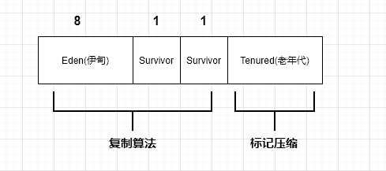

对象创建 & 对象存储位置 & 垃圾回收:

1. new对象, 进入eden区,若对象太大, 直接进入 tenured 区
2. 首次 YGC(minor GC): 大多数对象会被回收, 存活对象会进行S0区, 若对象太大,直接进入tenured区
3. 再次 YGC, 将 eden + S0 存活对象复制到 S1区
4. 再次 YGC, 将 eden + S1 存活对象复制到 S0区
5. 重复步骤 3,4, 每进行一次GC, 对象年龄 +1, 达到年龄阈值(默认15/CMS:6 , 可设置),进入老年代
6. 老年代(顽固分子) 满, FGC(major GC), 会回收 年轻代 + 老年代

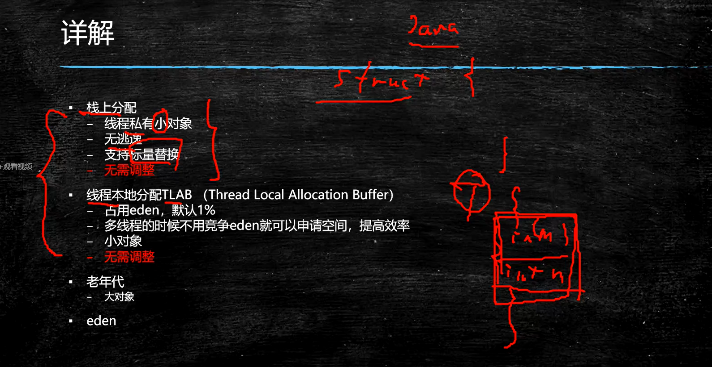


GC tunning: GC调优(分代调优)

目标:减少FGC, 减少STW时间(Stop the World)


垃圾回收器: 

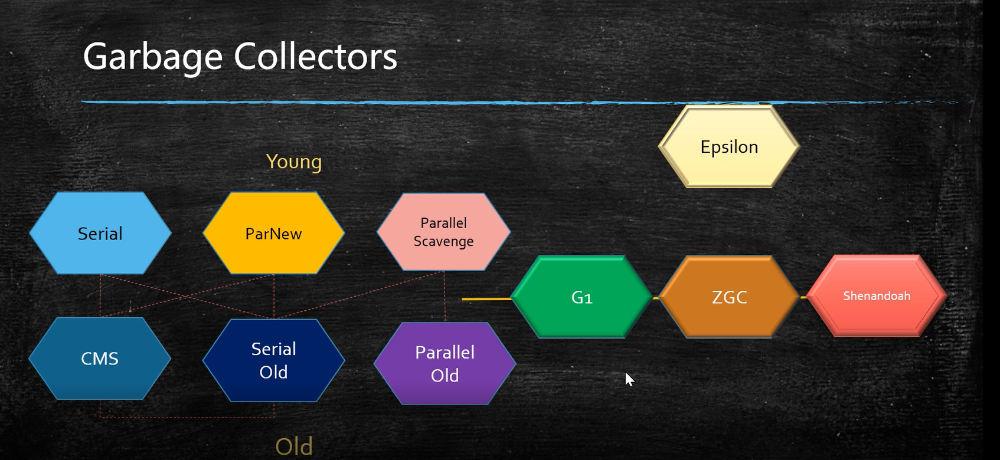


1. Serial / Serial Old 单线程串行 STW

   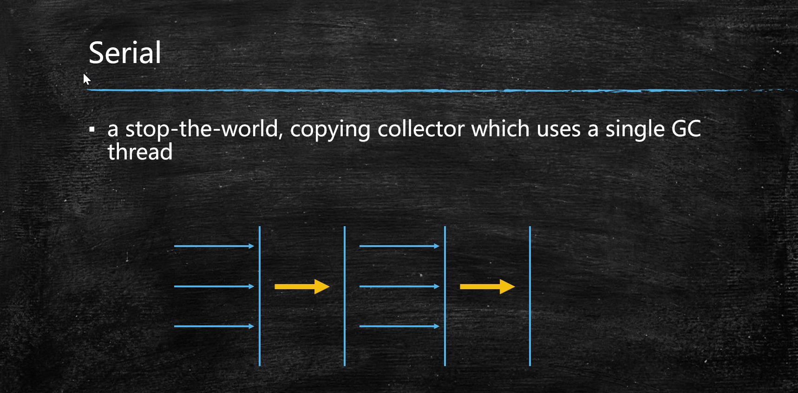

2. Parallel Scvenge / Parallel Old 多线程并行 STW

   PS吞吐量优先, PN响应时间优先

   吞吐量 = 执行代码时间 / 总时间 (执行代码时间+ STW) 

3. ParNew + CMS (ConcurrentMarkSweep) + Serial Old

   CMS : 并发, 标记清除算法, 一般配合ParNew 及 Serial Old使用, ParNew可配合CMS , PS不能, 

   CMS缺点:易产生内存碎片, 不能回收浮动垃圾, 若CMS停止工作, Serial Old开始工作(极慢)

   初始标记: 标记roots, 单线程,STW, 标记对象少, 时间很短.

   并发标记: 使用根可达算法标记 多线程 标记可达对象.

   重新标记: STW ,多线程标记 并发标记阶段 参数的对象

   并发清理: 清理垃圾, 同时在此期间会产生浮动垃圾, 只能等待下一次垃圾回收时清理.

   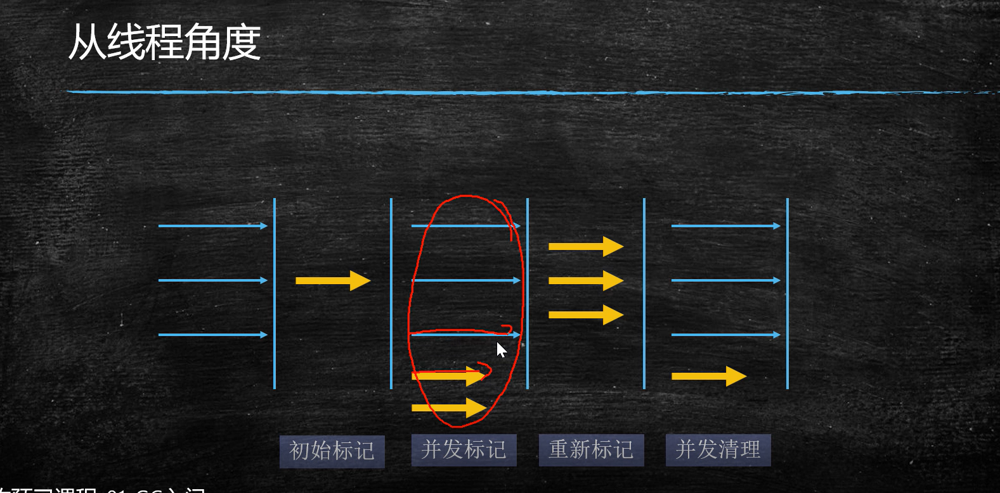

   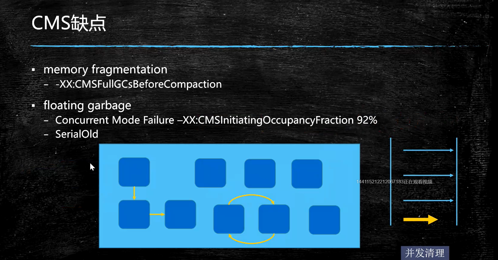

4. G1

5. xxx


-XX:ConcGCThreads=1 
-XX:G1ConcRefinementThreads=4 
-XX:GCDrainStackTargetSize=64 
-XX:InitialHeapSize=515777856 
-XX:MarkStackSize=4194304 
-XX:MaxHeapSize=8252445696 
-XX:MinHeapSize=6815736 
-XX:+PrintCommandLineFlags 
-XX:ReservedCodeCacheSize=251658240 
-XX:+SegmentedCodeCache 
-XX:+UseCompressedClassPointers 
-XX:+UseCompressedOops 
-XX:+UseG1GC 

能力欠缺 
|----阅读源码的能力, 快速了解API的能力.
|----测试模拟线上环境的能力,并根据情况进行调优.

软件工程职位分工:
|----后端程序员
|----前端程序员
|----测试
|----运维


## class文件结构


## 类加载过程

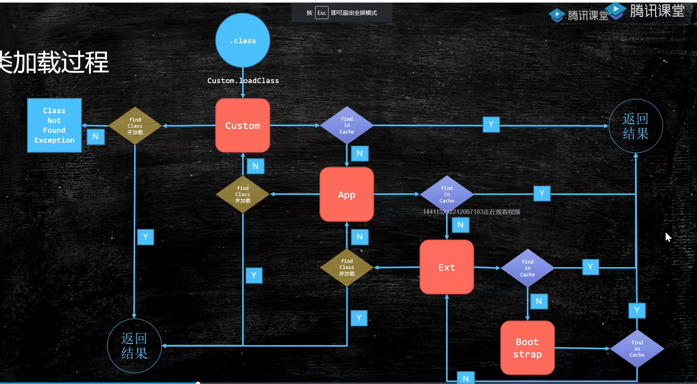

### loading 加载

​	将class文件加载到内存(方式可多种多样,如class文件,zip文件等)

​	JVM规范未规定何时加载,但规定以下情况必须加载:

	1. new, getStatic , putStatic , invoke_static 指令, 访问final 变量除外
	2. java.lang.reflect对类进行反射时调用时
	3. 初始化子类, 父类线初始化
	4. 虚拟机启动时, 被执行的主类必须初始化
	5. 动态语言支持java.lang.invoke.MethodHandle解析结果为Ref_getStatic, Ref_putStaic, ref_invokeStatic的方法句柄时, 该类必须被初始化.

### liking 连接

#### 	verification

​		验证class文件是否符合JVM规范

#### 	preparation

​		静态变量设置默认值

#### 	resolution

​		将类,方法,属性等符号引用解析为直接引用, 将常量池中的各种符号引用解析为为指针,偏移量等内存地址的直接引用

### initializing 初始化

​	调用类初始方法<cinit>,  将静态变量赋初始值

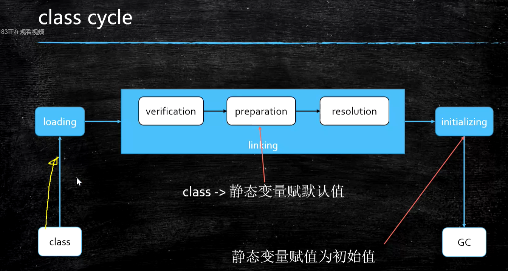


类加载到内存是创建了两个对象. 一个是class文件的二进制字节流, 一个是class对象, class对象指向 二进制字节流对象

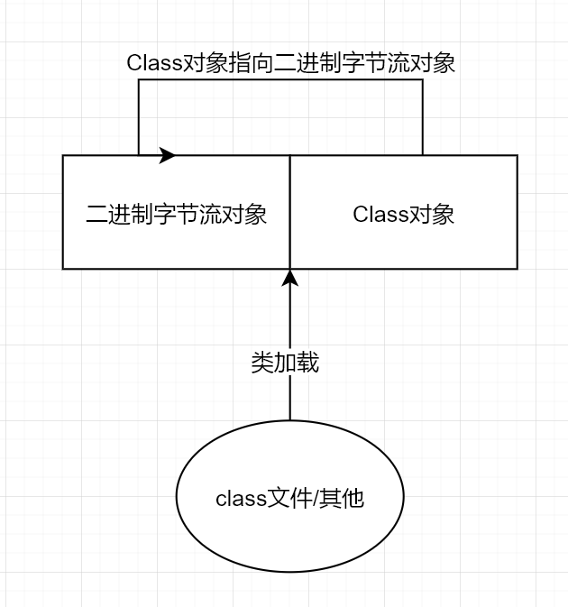

双亲委派模型

​	类加载器首先将加载过程委托给父加载器去加载,父加载器不能加载再自己加载

​	作用:安全, 防止自己写的类覆盖jdk原有的类,实现数据窃取等问题.

​	不同classloader加载的class文件不相等.

​	父加载器 不是 父类加载加载器,他们不是继承关系

​	加载路径 (具体见Lanucher类)  boostrap: sun.boot.class.path;  extension: java.ext.dirs ;  app: java.class.path 

​	自定义类加载器,只需实现findClass方法(模板方法)

​	**待做: 自定义ClassLoader, 实现 Jar文件加密**

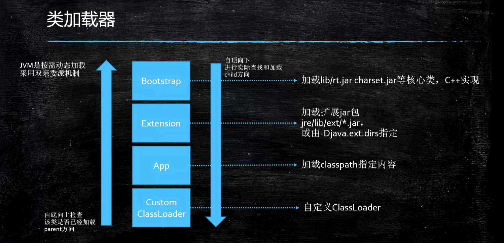


Java执行过程的三种模式

编译执行: 将class bytecode编译为本地代码执行, 启动慢,执行快,  -XComp

解释执行: 再执行过程中把 bytecode解释为本地代码执行, 启动快,执行慢, -Xint

混合模式: 刚开始解释执行,对热点代码(执行次数多的方法或代码块)编译为本地代码(Hot Spot由来) -Xmixed

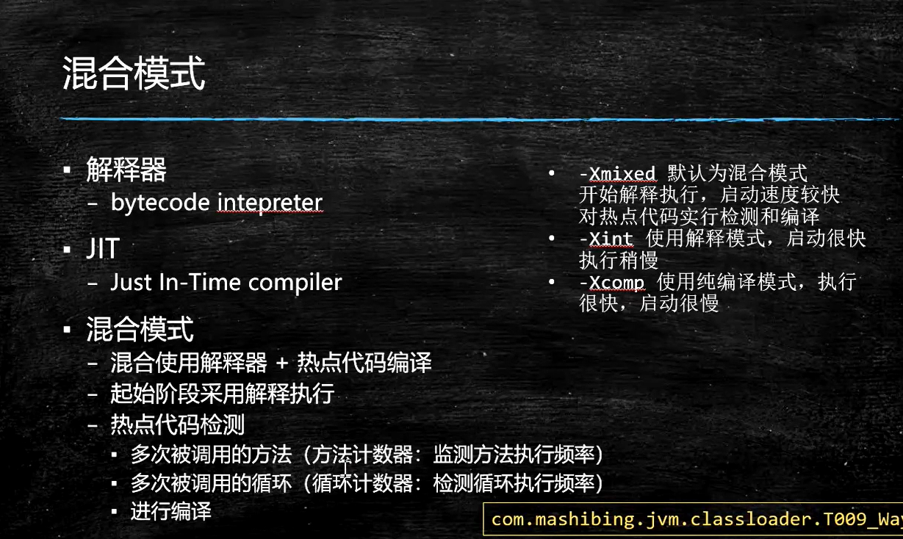

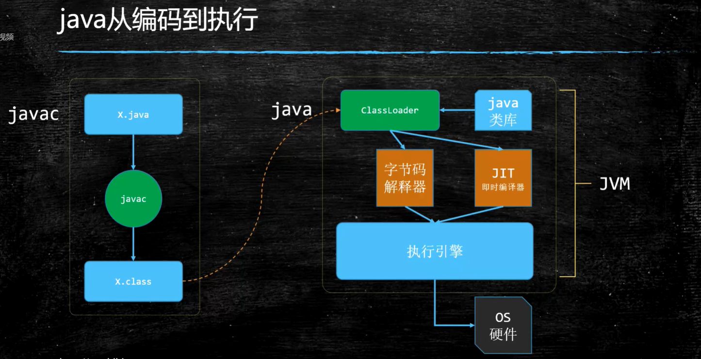


### JMM  Java Memory Model  java内存模型


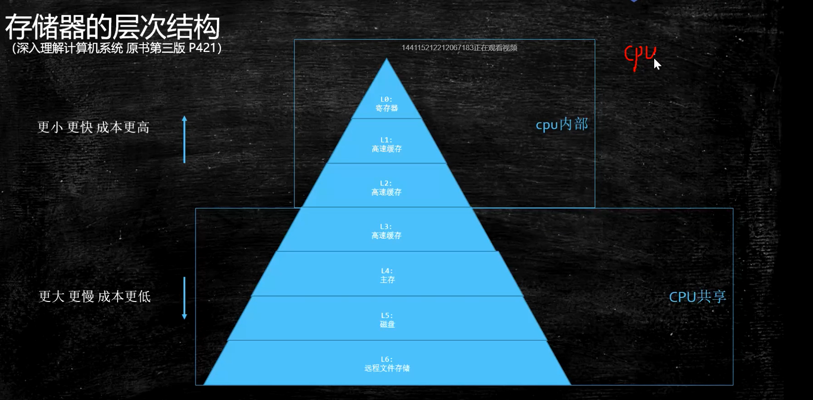

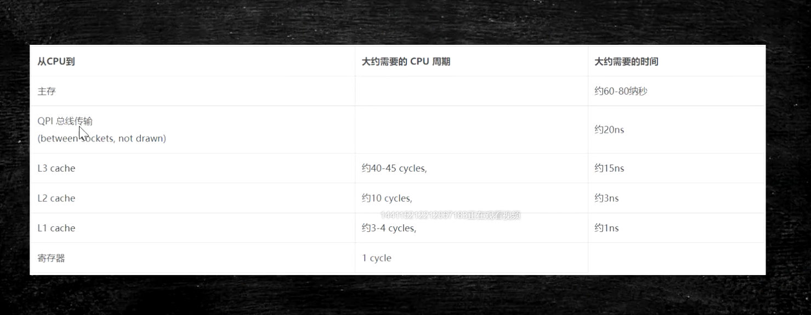

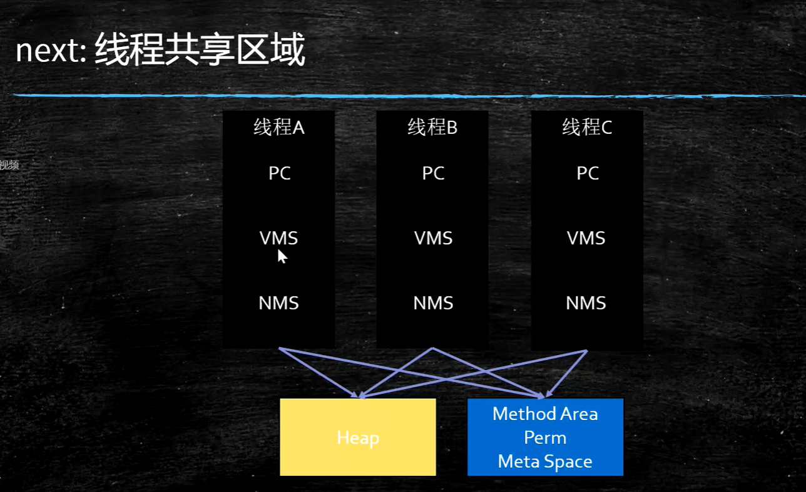

数据一致性问题(L1,L2数据不共享)

1.总线锁 (Bus Lock) 效率低

2.缓存一致性协议 (MESI --> 应用于缓存行)

缓存行: 为提高效率, 按整行读取,一般64字节

cpu乱序执行: cpu为提高效率,会在一条指令执行过程中去同时执行另一条指令,前提是两条指令无依赖关系(主要原因是cpu读取速度比内存快100倍)

合并写: wcBuffer, 介于L1与CPU之间


#### 有序性保障

硬件层面(x86):

CPU内存屏障 

sfence (save fence):  sfence前后的写操作不能重排

lfence (load fence): lfence前后读前后不能重排

mfence: mfence前后的读写操作都不能重排

cpu原子指令: lock , 一般在别的指令前加 

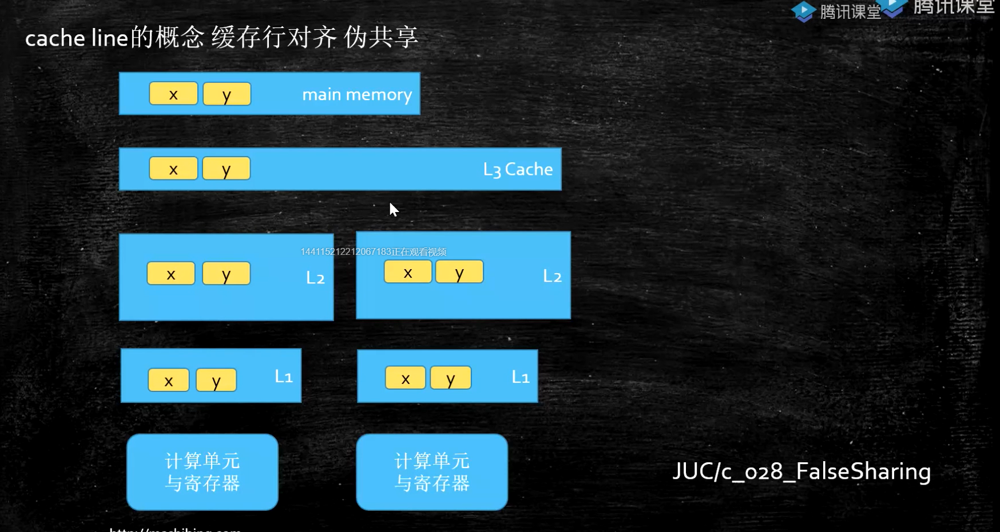


JVM层级

四种屏障:

loadload ,  storestore,  loadstore , storeload


volatile实现细节:

1.字节码层级: ACC_VOLATILE

2.JVM层面: 操作前后加屏障

3.OS和硬件层面:  Linux看具体的虚拟机实现,(可使用hsdis工具查看源码 <--> hotspot Dis Assember ) , windows使用lock指令实现

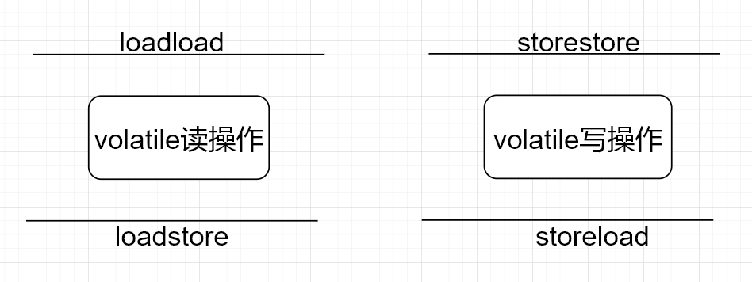

synchronized实现细节:

1.字节码层面: ACC_SYCHRONIZED 或 moniterenter / moniterexit指令(一个moniterenter和两个moniterexit指令)

2.JVM层面: C/C++调用操作系统提供的同步机制

3.OS和硬件层面: lock+指令+其他(x86)


对象内存布局

对象创建过程: 

1.class loading

2.class linking:  (1). verification.  (2).preparation. (3)resolution

3.class intializing

4.申请对象内存

5.成员变量赋默认值

6.调用构造方法<init> : (1). 成员变量顺序赋初始值 (2).执行构造方法语句


对象在内存中的存储布局

普通对象:

1.对象头(markword 8字节):

2.classPointer指针: -XX: +useCompressedClassPointer (压缩4字节,不压缩8字节)

3.实例数据: (1):基本类型 (2):应用类型: -XX:+useCompressOops (压缩为4字节,不压缩为8字节)

4.padding对齐: 对齐使得对象所占内存为8的倍数

备注: Oops: Ordinary Object Pointers 观察虚拟机参数: java  -XX:+printCommandLineFlags -version


数组对象:

1.对象头

2.ClassPointer

3.数组长度 4字节

4.数据数据

5.padding对齐


对象头内容:

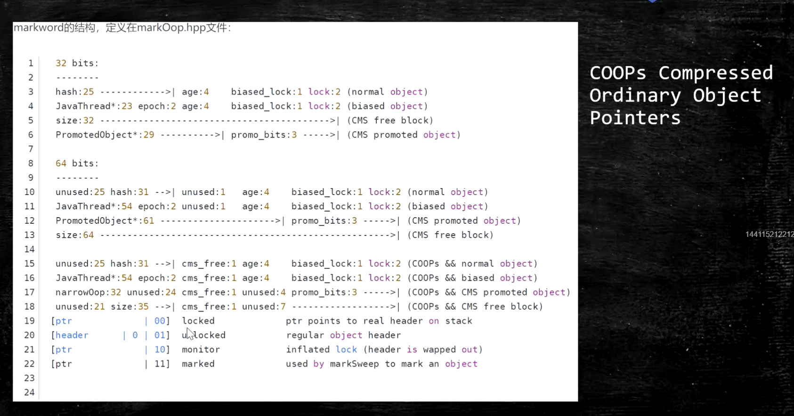

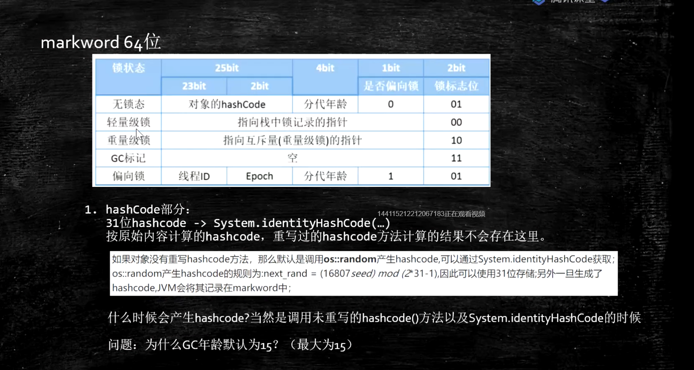


对象定位: 

1.句柄池: 效率低,GC效率高,  引用指向句柄对象, 句柄对象包含两个指针, 一个指向类对象, 一个指向实例对象

2.直接指针: hotspot使用, 效率高,GC效率低, 引用执行实例对象, 实例对象中包含类对象

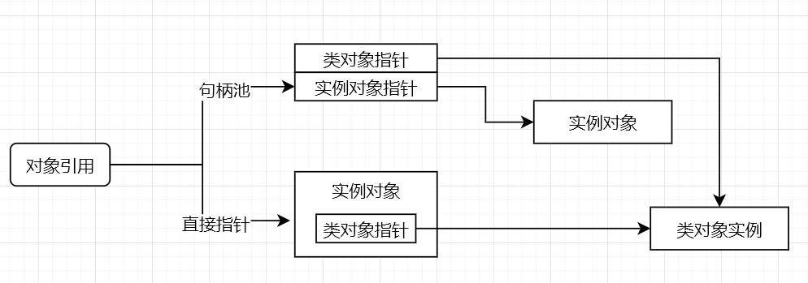


对象如何分配

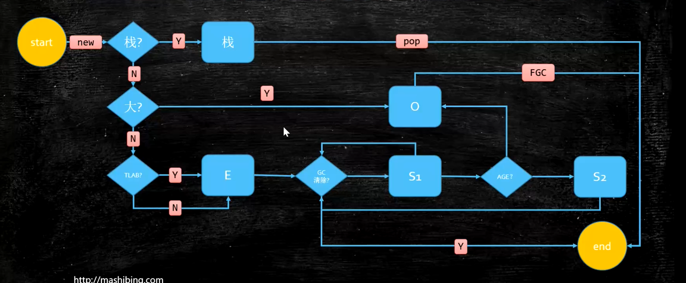 


Java运行时数据区和指令集

Runtime Data Area

PC: 存放指令位置, 线程独有

虚拟机的运行:伪代码

```java
while(not end){
	取pc值,找对应指令;
	执行指令;
	PC++;
}
```


方法中bytecode中的表示: 局部变量表 + 字节码 + 杂项 + 异常表 ;  字节码将数据 在局部变量表和操作数栈中进行操作.

虚拟机栈:

栈帧: 局部变量 + 操作数栈 + 动态链接 + 返回地址

一个方法对应一个栈帧, 一个虚拟机栈包含多个栈帧

指令集实现方式: 基于栈的指令集 和 基于寄存器


解析字节码执行方式

invoke_static 静态方法

invoke_virtual 自带多态

invoke_special: 执行可直接定位,不需要多态的方法 private, <init>

invoke_interface: 通过 interface 调用

invoke_dynamic: lamda表达式中会使用,反射/其他动态语言,动态产生的class会用到此指令,lambda会产生很多动态类


部分字节码解释:

load  将 数据 从 本地变量表 压入 栈

store 将 数据 从 栈 弹出 并赋值到 本地变量表

push 是将  常量 压入 栈 

getField 将引用 弹出栈  并将 field值获取到并压入栈

add/multi/xxx 是将两个数弹出栈做完运算后将结果鸭压入栈

ldc 将常量池的数据压入栈

方法执行 invoke_xxx  过程是 将方法所属类引用 ,所需参数 弹出栈 并新启一个栈帧 来执行


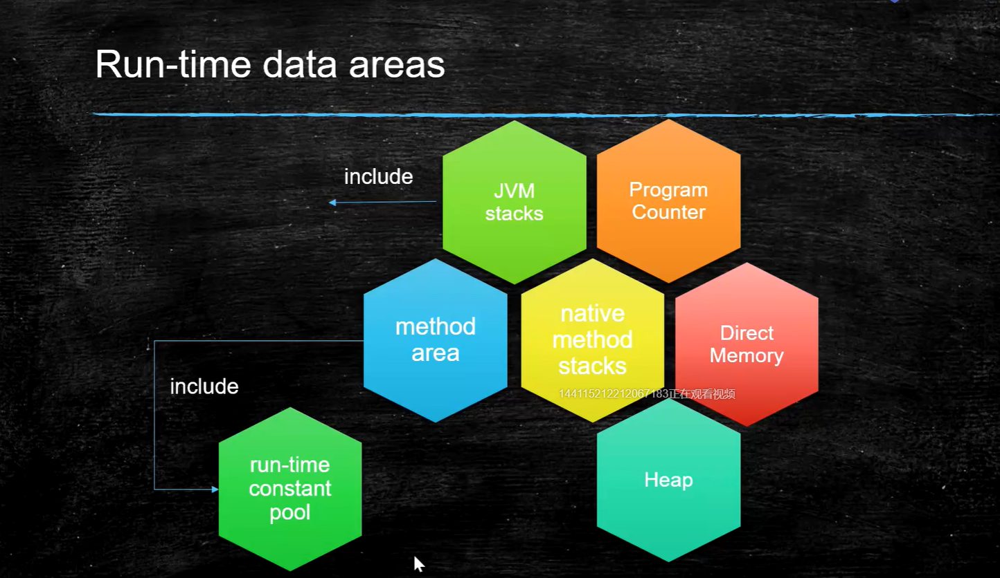


JVM Tunning

查看java命令含义

java -X : 查看-X的命令


命令:

-Xmn10M  设置新生代大小

-Xms10M 设置最小堆大小

-Xmx10M 设置最大堆大小 (备注: 一般最好将 最小堆大小和最大堆大小设置一样, 不用操作系统去计算什么时候扩容什么时候减少容量)

 -XX:+PrintCommandLineFlags   查看启动参数

-XX:+PrintFlagsInitial 打印所有初始参数

-XX:+PrintFlagsFinal 打印所有最终参数  查看参数命令: java -XX:PrintFlagsFinal | grep GC

-XX:+PrintGC 打印GC内容

-XX:+HeapDumpOnOutOfMemoryError 

在T01_HelloGC中设置启动参数: -Xmn10M -Xms40M -Xmx60M -XX:+PrintCommandLineFlags -XX:+PrintGC

```java
package com.mashibing.jvm.c5_gc;
//-XX:+PrintGCDetails -XX:+UseConcMarkSweepGC -XX:+PrintFlagsFinal -XX:+PrintVMOptions -
public class T01_HelloGC {
    public static void main(String[] args) {
		//需要1000M内存,无法分配下
        for(int i=0; i<10000; i++) {
            byte[] b = new byte[1024 * 1024];
        }
    }
}
```

打印日志(-XX:+PrintGC)

```
-XX:InitialHeapSize=20971520 -XX:MaxHeapSize=20971520 -XX:MaxNewSize=10485760 -XX:NewSize=10485760 -XX:+PrintCommandLineFlags -XX:+PrintGC -XX:+UseCompressedClassPointers -XX:+UseCompressedOops -XX:-UseLargePagesIndividualAllocation -XX:+UseParallelGC 
[GC (Allocation Failure)  1679K->784K(19456K), 0.0010647 secs]
[GC (Allocation Failure)  784K->800K(19456K), 0.0009715 secs]
[Full GC (Allocation Failure)  800K->594K(19456K), 0.0034400 secs]
[GC (Allocation Failure)  594K->594K(19456K), 0.0002646 secs]
[Full GC (Allocation Failure)  594K->577K(19456K), 0.0045077 secs]

GC/Full GC : GC类型还是YGC还是FullGC
(Allocation Failure) : 原因, 分配失败
1679K -> 784K(19456K) 8167K回收前内存, 752K回收后内存,19456K总的堆内存
0.0006316 secs 耗时
```

打印日志(-XX:+PrintGCDetails -XX:+UseConcMarkSweepGC)

```
[root@iZayh0sefq8i9iZ app]# java -Xmn10M -Xms40M -Xmx60M -XX:+PrintCommandLineFlags -XX:+PrintGCDetails -XX:+UseConcMarkSweepGC HelloGC 
-XX:InitialHeapSize=41943040 -XX:MaxHeapSize=62914560 -XX:MaxNewSize=10485760 -XX:MaxTenuringThreshold=6 -XX:NewSize=10485760 -XX:OldPLABSize=16 -XX:+PrintCommandLineFlags -XX:+PrintGCDetails -XX:+UseCompressedClassPointers -XX:+UseCompressedOops -XX:+UseConcMarkSweepGC -XX:+UseParNewGC 
HelloGC!
[GC (Allocation Failure) [ParNew: 7675K->260K(9216K), 0.0042564 secs] 7675K->7430K(39936K), 0.0042903 secs] [Times: user=0.00 sys=0.00, real=0.00 secs] 
[GC (Allocation Failure) [ParNew: 7590K->390K(9216K), 0.0036086 secs] 14760K->14728K(39936K), 0.0036331 secs] [Times: user=0.00 sys=0.01, real=0.01 secs] 
[GC (Allocation Failure) [ParNew: 7712K->481K(9216K), 0.0030846 secs] 22050K->21988K(39936K), 0.0031062 secs] [Times: user=0.00 sys=0.00, real=0.00 secs] 
[GC (Allocation Failure) [ParNew: 7805K->312K(9216K), 0.0036817 secs] 29312K->28986K(39936K), 0.0037126 secs] [Times: user=0.01 sys=0.00, real=0.00 secs] 
[GC (Allocation Failure) [ParNew: 7638K->462K(9216K), 0.0040245 secs] 36312K->36305K(46104K), 0.0040475 secs] [Times: user=0.00 sys=0.00, real=0.01 secs] 
[GC (Allocation Failure) [ParNew: 7789K->307K(9216K), 0.0049889 secs] 43631K->43318K(53300K), 0.0050127 secs] [Times: user=0.00 sys=0.01, real=0.00 secs] 
[GC (Allocation Failure) [ParNew (promotion failed): 7635K->7558K(9216K), 0.0056199 secs][CMS: 49406K->49404K(50252K), 0.0104050 secs] 50645K->50435K(59468K), [Metaspace: 2504K->2504K(1056768K)], 0.0162334 secs] [Times: user=0.01 sys=0.00, real=0.02 secs] 
[GC (Allocation Failure) [ParNew: 7335K->7335K(9216K), 0.0000141 secs][CMS: 49404K->50436K(51200K), 0.0030010 secs] 56739K->56580K(60416K), [Metaspace: 2504K->2504K(1056768K)], 0.0030447 secs] [Times: user=0.01 sys=0.00, real=0.01 secs] 
[Full GC (Allocation Failure) [CMS: 50436K->50436K(51200K), 0.0011270 secs] 57604K->57604K(60416K), [Metaspace: 2504K->2504K(1056768K)], 0.0011491 secs] [Times: user=0.00 sys=0.00, real=0.00 secs] 
[Full GC (Allocation Failure) [CMS: 50436K->50424K(51200K), 0.0022217 secs] 57604K->57592K(60416K), [Metaspace: 2504K->2504K(1056768K)], 0.0022403 secs] [Times: user=0.00 sys=0.00, real=0.00 secs] 
Exception in thread "main" java.lang.OutOfMemoryError: Java heap space
	at HelloGC.main(HelloGC.java:9)
Heap
 par new generation   total 9216K, used 7484K [0x00000000fc400000, 0x00000000fce00000, 0x00000000fce00000)
  eden space 8192K,  91% used [0x00000000fc400000, 0x00000000fcb4f0e8, 0x00000000fcc00000)
  from space 1024K,   0% used [0x00000000fcd00000, 0x00000000fcd00000, 0x00000000fce00000)
  to   space 1024K,   0% used [0x00000000fcc00000, 0x00000000fcc00000, 0x00000000fcd00000)
 concurrent mark-sweep generation total 51200K, used 50424K [0x00000000fce00000, 0x0000000100000000, 0x0000000100000000)
 Metaspace       used 2535K, capacity 4486K, committed 4864K, reserved 1056768K
  class space    used 272K, capacity 386K, committed 512K, reserved 1048576K
  
  备注:user用户态,sys系统态 [0x00000000fc400000, 0x00000000fce00000, 0x00000000fce00000) 分别为 开始地址,使用结束地址, 总结束地址
```


jinfo pid

```
[root@iZayh0sefq8i9iZ app]# jinfo 5896 //命令执行行


Attaching to process ID 5896, please wait...
Debugger attached successfully.
Server compiler detected.
JVM version is 25.271-b09
Java System Properties:

java.runtime.name = Java(TM) SE Runtime Environment
java.vm.version = 25.271-b09
sun.boot.library.path = /usr/local/jdk/jre/lib/amd64
java.vendor.url = http://java.oracle.com/
java.vm.vendor = Oracle Corporation
path.separator = :
file.encoding.pkg = sun.io
java.vm.name = Java HotSpot(TM) 64-Bit Server VM
sun.os.patch.level = unknown
sun.java.launcher = SUN_STANDARD
user.country = US
user.dir = /usr/local/app
java.vm.specification.name = Java Virtual Machine Specification
java.runtime.version = 1.8.0_271-b09
java.awt.graphicsenv = sun.awt.X11GraphicsEnvironment
os.arch = amd64
java.endorsed.dirs = /usr/local/jdk/jre/lib/endorsed
java.io.tmpdir = /tmp
line.separator = 

java.vm.specification.vendor = Oracle Corporation
os.name = Linux
sun.jnu.encoding = UTF-8
java.library.path = /usr/java/packages/lib/amd64:/usr/lib64:/lib64:/lib:/usr/lib
java.specification.name = Java Platform API Specification
java.class.version = 52.0
sun.management.compiler = HotSpot 64-Bit Tiered Compilers
os.version = 4.18.0-193.28.1.el8_2.x86_64
user.home = /root
user.timezone = 
java.awt.printerjob = sun.print.PSPrinterJob
file.encoding = UTF-8
java.specification.version = 1.8
user.name = root
java.class.path = .:/usr/local/jdk/lib/dt.jar:/usr/local/jdk/lib/tools.jar
java.vm.specification.version = 1.8
sun.arch.data.model = 64
sun.java.command = T15_FullGC_Problem01
java.home = /usr/local/jdk/jre
user.language = en
java.specification.vendor = Oracle Corporation
awt.toolkit = sun.awt.X11.XToolkit
java.vm.info = mixed mode
java.version = 1.8.0_271
java.ext.dirs = /usr/local/jdk/jre/lib/ext:/usr/java/packages/lib/ext
sun.boot.class.path = /usr/local/jdk/jre/lib/resources.jar:/usr/local/jdk/jre/lib/rt.jar:/usr/local/jdk/jre/lib/sunrsasign.jar:/usr/local/jdk/jre/lib/jsse.jar:/usr/local/jdk/jre/lib/jce.jar:/usr/local/jdk/jre/lib/charsets.jar:/usr/local/jdk/jre/lib/jfr.jar:/usr/local/jdk/jre/classes
java.vendor = Oracle Corporation
file.separator = /
java.vendor.url.bug = http://bugreport.sun.com/bugreport/
sun.io.unicode.encoding = UnicodeLittle
sun.cpu.endian = little
sun.cpu.isalist = 

VM Flags:
Non-default VM flags: -XX:CICompilerCount=2 -XX:InitialHeapSize=209715200 -XX:MaxHeapSize=209715200 -XX:MaxNewSize=69861376 -XX:MinHeapDeltaBytes=196608 -XX:NewSize=69861376 -XX:OldSize=139853824 -XX:+PrintGC -XX:+UseCompressedClassPointers -XX:+UseCompressedOops 
Command line:  -Xms200M -Xmx200M -XX:+PrintGC

```


jstat -gc pid time

```
[root@iZayh0sefq8i9iZ app]#  jstat -gc 5896 1000 //命令行 

 S0C    S1C    S0U    S1U      EC       EU        OC         OU       MC     MU    CCSC   CCSU   YGC     YGCT    FGC    FGCT     GCT   
6784.0 6784.0  0.0   6784.0 54656.0  54656.0   136576.0   136576.0  4864.0 3858.2 512.0  420.1      14    0.589 3448  2255.605 2256.194
6784.0 6784.0  0.0   6784.0 54656.0  54656.0   136576.0   136576.0  4864.0 3858.2 512.0  420.1      14    0.589 3449  2256.487 2257.076
6784.0 6784.0  0.0   6778.7 54656.0  54656.0   136576.0   136576.0  4864.0 3858.2 512.0  420.1      14    0.589 3449  2257.142 2257.731
6784.0 6784.0  0.0   6775.3 54656.0  54656.0   136576.0   136576.0  4864.0 3858.2 512.0  420.1      14    0.589 3450  2257.770 2258.359
6784.0 6784.0  0.0   6784.0 54656.0  54656.0   136576.0   136576.0  4864.0 3858.2 512.0  420.1      14    0.589 3451  2257.770 2258.359

备注: S0C S1C 含义???```````````````````````

```


jmap -histo pid | head -20 

```
[root@iZayh0sefq8i9iZ app]# jmap -histo 7525 | head -20

 num     #instances         #bytes  class name
----------------------------------------------
   1:       1975400      142228800  java.util.concurrent.ScheduledThreadPoolExecutor$ScheduledFutureTask
   2:       1975426       79017040  java.math.BigDecimal
   3:       1975400       63212800  T15_FullGC_Problem01$CardInfo
   4:       1975401       47409624  java.util.Date
   5:       1975400       47409600  java.util.concurrent.Executors$RunnableAdapter
   6:       1975400       31606400  T15_FullGC_Problem01$$Lambda$15/1688376486
   7:             2        8088000  [Ljava.util.concurrent.RunnableScheduledFuture;
   8:        109730        3511360  java.util.concurrent.locks.AbstractQueuedSynchronizer$Node
   9:           970        1063480  [I
  10:          4231         300688  [C
  11:          2178         196224  [Ljava.lang.Object;
  12:          1655         187512  java.lang.Class
  13:          4211         101064  java.lang.String
  14:           424          37312  java.lang.reflect.Method
  15:            32          37096  [B
  16:           691          22112  java.util.HashMap$Node
  17:            58          21808  java.lang.Thread

```


jconsole 图形界面

jVisualVM 图形界面


现有问题:

JMX无法连接

jstack 信息分析 : 一个死锁程序,  一个很多线程等待的程序;


jhat filename.hprof  分析dump文件

报异常见下代码

```
[root@iZayh0sefq8i9iZ app]# jhat heapdump.hprof 
Reading from heapdump.hprof...
Dump file created Sat Jan 09 23:18:22 CST 2021
Exception in thread "main" java.lang.OutOfMemoryError: Java heap space
	at com.sun.tools.hat.internal.model.Snapshot.makeId(Snapshot.java:586)
	at com.sun.tools.hat.internal.model.Snapshot.addHeapObject(Snapshot.java:166)
	at com.sun.tools.hat.internal.parser.HprofReader.readInstance(HprofReader.java:744)
	at com.sun.tools.hat.internal.parser.HprofReader.readHeapDump(HprofReader.java:491)
	at com.sun.tools.hat.internal.parser.HprofReader.read(HprofReader.java:238)
	at com.sun.tools.hat.internal.parser.Reader.readFile(Reader.java:92)
	at com.sun.tools.hat.Main.main(Main.java:159)
```

添加参数:

jhat -J-mx20M filename

然后可以通过7000端口访问

下拉框到最后 other , 可看到那个类有多少, 同时也可以通过查询语句来查看信息

如 select s from String s , 具体可见帮助文档了

备注: 现在遇到的问题为 aliyun的那台服务器无法通过远程访问, 本地的可以通过远程访问


Arthas

下载: https://github.com/alibaba/arthas/blob/master/README_CN.md

启动: java -jar arthas-boot.jar

备注: 先启动程序, 然后启动Arthas ,  Arthas会给启动的java程序编号, 按编号值进入具体的


Arthas command

help:  查看有哪些命令

```
[arthas@8214]$ help
 NAME         DESCRIPTION                                                                                                                                                                                                                        
 help         Display Arthas Help                                                                                                                                                                                                                
 keymap       Display all the available keymap for the specified connection.                                                                                                                                                                     
 sc           Search all the classes loaded by JVM                                                                                                                                                                                               
 sm           Search the method of classes loaded by JVM                                                                                                                                                                                         
 classloader  Show classloader info                                                                                                                                                                                                              
 jad          Decompile class                                                                                                                                                                                                                    
 getstatic    Show the static field of a class                                                                                                                                                                                                   
 monitor      Monitor method execution statistics, e.g. total/success/failure count, average rt, fail rate, etc.                                                                                                                                 
 stack        Display the stack trace for the specified class and method                                                                                                                                                                         
 thread       Display thread info, thread stack                                                                                                                                                                                                  
 trace        Trace the execution time of specified method invocation.                                                                                                                                                                           
 watch        Display the input/output parameter, return object, and thrown exception of specified method invocation                                                                                                                             
 tt           Time Tunnel                                                                                                                                                                                                                        
 jvm          Display the target JVM information                                                                                                                                                                                                 
 perfcounter  Display the perf counter information.                                                                                                                                                                                              
 ognl         Execute ognl expression.                                                                                                                                                                                                           
 mc           Memory compiler, compiles java files into bytecode and class files in memory.                                                                                                                                                      
 redefine     Redefine classes. @see Instrumentation#redefineClasses(ClassDefinition...)                                                                                                                                                         
 dashboard    Overview of target jvm's thread, memory, gc, vm, tomcat info.                                                                                                                                                                      
 dump         Dump class byte array from JVM                                                                                                                                                                                                     
 heapdump     Heap dump                                                                                                                                                                                                                          
 options      View and change various Arthas options                                                                                                                                                                                             
 cls          Clear the screen                                                                                                                                                                                                                   
 reset        Reset all the enhanced classes                                                                                                                                                                                                     
 version      Display Arthas version                                                                                                                                                                                                             
 session      Display current session information                                                                                                                                                                                                
 sysprop      Display, and change the system properties.                                                                                                                                                                                         
 sysenv       Display the system env.                                                                                                                                                                                                            
 vmoption     Display, and update the vm diagnostic options.                                                                                                                                                                                     
 logger       Print logger info, and update the logger level                                                                                                                                                                                     
 history      Display command history                                                                                                                                                                                                            
 cat          Concatenate and print files                                                                                                                                                                                                        
 echo         write arguments to the standard output                                                                                                                                                                                             
 pwd          Return working directory name                                                                                                                                                                                                      
 mbean        Display the mbean information                                                                                                                                                                                                      
 grep         grep command for pipes.                                                                                                                                                                                                            
 tee          tee command for pipes.                                                                                                                                                                                                             
 profiler     Async Profiler. https://github.com/jvm-profiling-tools/async-profiler                                                                                                                                                              
 stop         Stop/Shutdown Arthas server and exit the console.    
```

jvm : 信息类似  jinfo

```
[arthas@8214]$ jvm
 RUNTIME                                                                                                                                                                                                                                         
-------------------------------------------------------------------------------------------------------------------------------------------------------------------------------------------------------------------------------------------------
 MACHINE-NAME                                                         8214@iZayh0sefq8i9iZ                                                                                                                                                       
 JVM-START-TIME                                                       2021-01-09 22:46:51                                                                                                                                                        
 MANAGEMENT-SPEC-VERSION                                              1.2                                                                                                                                                                        
 SPEC-NAME                                                            Java Virtual Machine Specification                                                                                                                                         
 SPEC-VENDOR                                                          Oracle Corporation                                                                                                                                                         
 SPEC-VERSION                                                         1.8                                                                                                                                                                        
 VM-NAME                                                              Java HotSpot(TM) 64-Bit Server VM                                                                                                                                          
 VM-VENDOR                                                            Oracle Corporation                                                                                                                                                         
 VM-VERSION                                                           25.271-b09                                                                                                                                                                 
 INPUT-ARGUMENTS                                                      -Xms200M                                                                                                                                                                   
                                                                      -Xmx200M                                                                                                                                                                   
                                                                      -XX:+PrintGC                                                                                                                                                               
                                                                                                                                                                                                                                                 
 CLASS-PATH                                                           .:/usr/local/jdk/lib/dt.jar:/usr/local/jdk/lib/tools.jar                                                                                                                   
 BOOT-CLASS-PATH                                                      /usr/local/jdk/jre/lib/resources.jar:/usr/local/jdk/jre/lib/rt.jar:/usr/local/jdk/jre/lib/sunrsasign.jar:/usr/local/jdk/jre/lib/jsse.jar:/usr/local/jdk/jre/lib/jce.jar:/u 
                                                                      sr/local/jdk/jre/lib/charsets.jar:/usr/local/jdk/jre/lib/jfr.jar:/usr/local/jdk/jre/classes                                                                                
 LIBRARY-PATH                                                         /usr/java/packages/lib/amd64:/usr/lib64:/lib64:/lib:/usr/lib                                                                                                               
                                                                                                                                                                                                                                                 
-------------------------------------------------------------------------------------------------------------------------------------------------------------------------------------------------------------------------------------------------
 CLASS-LOADING                                                                                                                                                                                                                                   
-------------------------------------------------------------------------------------------------------------------------------------------------------------------------------------------------------------------------------------------------
 LOADED-CLASS-COUNT                                                   3948                                                                                                                                                                       
 TOTAL-LOADED-CLASS-COUNT                                             3948                                                                                                                                                                       
 UNLOADED-CLASS-COUNT                                                 0                                                                                                                                                                          
 IS-VERBOSE                                                           false                                                                                                                                                                      
                                                                                                                                                                                                                                                 
-------------------------------------------------------------------------------------------------------------------------------------------------------------------------------------------------------------------------------------------------
 COMPILATION                                                                                                                                                                                                                                     
-------------------------------------------------------------------------------------------------------------------------------------------------------------------------------------------------------------------------------------------------
 NAME                                                                 HotSpot 64-Bit Tiered Compilers                                                                                                                                            
 TOTAL-COMPILE-TIME                                                   2829                                                                                                                                                                       
 [time (ms)]                                                                                                                                                                                                                                     
                                                                                                                                                                                                                                                 
-------------------------------------------------------------------------------------------------------------------------------------------------------------------------------------------------------------------------------------------------
 GARBAGE-COLLECTORS                                                                                                                                                                                                                              
-------------------------------------------------------------------------------------------------------------------------------------------------------------------------------------------------------------------------------------------------
 Copy                                                                 name : Copy                                                                                                                                                                
 [count/time (ms)]                                                    collectionCount : 11                                                                                                                                                       
                                                                      collectionTime : 413                                                                                                                                                       
                                                                                                                                                                                                                                                 
 MarkSweepCompact                                                     name : MarkSweepCompact                                                                                                                                                    
 [count/time (ms)]                                                    collectionCount : 1                                                                                                                                                        
                                                                      collectionTime : 157                                                                                                                                                       
                                                                                                                                                                                                                                                 
                                                                                                                                                                                                                                                 
-------------------------------------------------------------------------------------------------------------------------------------------------------------------------------------------------------------------------------------------------
 MEMORY-MANAGERS                                                                                                                                                                                                                                 
-------------------------------------------------------------------------------------------------------------------------------------------------------------------------------------------------------------------------------------------------
 CodeCacheManager                                                     Code Cache                                                                                                                                                                 
                                                                                                                                                                                                                                                 
 Metaspace Manager                                                    Metaspace                                                                                                                                                                  
                                                                      Compressed Class Space                                                                                                                                                     
                                                                                                                                                                                                                                                 
 Copy                                                                 Eden Space                                                                                                                                                                 
                                                                      Survivor Space                                                                                                                                                             
                                                                                                                                                                                                                                                 
 MarkSweepCompact                                                     Eden Space                                                                                                                                                                 
                                                                      Survivor Space                                                                                                                                                             
                                                                      Tenured Gen                                                                                                                                                                
                                                                                                                                                                                                                                                 
                                                                                                                                                                                                                                                 
-------------------------------------------------------------------------------------------------------------------------------------------------------------------------------------------------------------------------------------------------
 MEMORY                                                                                                                                                                                                                                          
-------------------------------------------------------------------------------------------------------------------------------------------------------------------------------------------------------------------------------------------------
 HEAP-MEMORY-USAGE                                                    init : 209715200(200.0 MiB)                                                                                                                                                
 [memory in bytes]                                                    used : 176589776(168.4 MiB)                                                                                                                                                
                                                                      committed : 202768384(193.4 MiB)                                                                                                                                           
                                                                      max : 202768384(193.4 MiB)                                                                                                                                                 
                                                                                                                                                                                                                                                 
 NO-HEAP-MEMORY-USAGE                                                 init : 2555904(2.4 MiB)                                                                                                                                                    
 [memory in bytes]                                                    used : 30679480(29.3 MiB)                                                                                                                                                  
                                                                      committed : 31768576(30.3 MiB)                                                                                                                                             
                                                                      max : -1(-1 B)                                                                                                                                                             
                                                                                                                                                                                                                                                 
 PENDING-FINALIZE-COUNT                                               0                                                                                                                                                                          
                                                                                                                                                                                                                                                 
-------------------------------------------------------------------------------------------------------------------------------------------------------------------------------------------------------------------------------------------------
 OPERATING-SYSTEM                                                                                                                                                                                                                                
-------------------------------------------------------------------------------------------------------------------------------------------------------------------------------------------------------------------------------------------------
 OS                                                                   Linux                                                                                                                                                                      
 ARCH                                                                 amd64                                                                                                                                                                      
 PROCESSORS-COUNT                                                     1                                                                                                                                                                          
 LOAD-AVERAGE                                                         0.12                                                                                                                                                                       
 VERSION                                                              4.18.0-193.28.1.el8_2.x86_64                                                                                                                                               
                                                                                                                                                                                                                                                 
-------------------------------------------------------------------------------------------------------------------------------------------------------------------------------------------------------------------------------------------------
 THREAD                                                                                                                                                                                                                                          
-------------------------------------------------------------------------------------------------------------------------------------------------------------------------------------------------------------------------------------------------
 COUNT                                                                64                                                                                                                                                                         
 DAEMON-COUNT                                                         13                                                                                                                                                                         
 PEAK-COUNT                                                           64                                                                                                                                                                         
 STARTED-COUNT                                                        67                                                                                                                                                                         
 DEADLOCK-COUNT                                                       0                                                                                                                                                                          
                                                                                                                                                                                                                                                 
-------------------------------------------------------------------------------------------------------------------------------------------------------------------------------------------------------------------------------------------------
 FILE-DESCRIPTOR                                                                                                                                                                                                                                 
-------------------------------------------------------------------------------------------------------------------------------------------------------------------------------------------------------------------------------------------------
 MAX-FILE-DESCRIPTOR-COUNT                                            65535                                                                                                                                                                      
 OPEN-FILE-DESCRIPTOR-COUNT                                           49                                                                                                                                                                         
 
```


thread 线程信息

```
[arthas@8214]$ thread
Threads Total: 69, NEW: 0, RUNNABLE: 7, BLOCKED: 0, WAITING: 53, TIMED_WAITING: 4, TERMINATED: 0, Internal threads: 5                                                                                                                            
ID        NAME                                                        GROUP                         PRIORITY             STATE               %CPU                DELTA_TIME          TIME                INTERRUPTED         DAEMON              
25        pool-1-thread-18                                            main                          5                    TIMED_WAITING       12.84               0.026               0:1.676             false               false               
71        arthas-command-execute                                      system                        5                    RUNNABLE            0.54                0.001               0:0.106             false               true                
56        pool-1-thread-49                                            main                          5                    WAITING             0.39                0.000               0:1.003             false               false               
9         pool-1-thread-2                                             main                          5                    WAITING             0.38                0.000               0:2.849             false               false               
23        pool-1-thread-16                                            main                          5                    WAITING             0.3                 0.000               0:10.672            false               false               
12        pool-1-thread-5                                             main                          5                    WAITING             0.27                0.000               0:1.101             false               false               
53        pool-1-thread-46                                            main                          5                    WAITING             0.26                0.000               0:1.056             false               false               
11        pool-1-thread-4                                             main                          5                    WAITING             0.25                0.000               0:1.061             false               false               
47        pool-1-thread-40                                            main                          5                    WAITING             0.25                0.000               0:1.088             false               false               
8         pool-1-thread-1                                             main                          5                    WAITING             0.24                0.000               0:1.586             false               false               
10        pool-1-thread-3                                             main                          5                    WAITING             0.24                0.000               0:1.032             false               false               
33        pool-1-thread-26                                            main                          5                    WAITING             0.24                0.000               0:3.472             false               false               
57        pool-1-thread-50                                            main                          5                    WAITING             0.23                0.000               0:1.049             false               false               
13        pool-1-thread-6                                             main                          5                    WAITING             0.23                0.000               0:1.043             false               false               
38        pool-1-thread-31                                            main                          5                    WAITING             0.23                0.000               0:13.565            false               false               
14        pool-1-thread-7                                             main                          5                    WAITING             0.22                0.000               0:1.058             false               false               
20        pool-1-thread-13                                            main                          5                    WAITING             0.22                0.000               0:1.100             false               false               
16        pool-1-thread-9                                             main                          5                    WAITING             0.21                0.000               0:1.044             false               false               
18        pool-1-thread-11                                            main                          5                    WAITING             0.21                0.000               0:1.064             false               false               
17        pool-1-thread-10                                            main                          5                    WAITING             0.21                0.000               0:1.045             false               false               
31        pool-1-thread-24                                            main                          5                    WAITING             0.2                 0.000               0:1.043             false               false               
22        pool-1-thread-15                                            main                          5                    WAITING             0.2                 0.000               0:1.045             false               false               
52        pool-1-thread-45                                            main                          5                    WAITING             0.2                 0.000               0:1.040             false               false               
15        pool-1-thread-8                                             main                          5                    WAITING             0.2                 0.000               0:1.022             false               false               
21        pool-1-thread-14                                            main                          5                    WAITING             0.2                 0.000               0:1.062             false               false               
19        pool-1-thread-12                                            main                          5                    WAITING             0.2                 0.000               0:2.589             false               false               
41        pool-1-thread-34                                            main                          5                    WAITING             0.2                 0.000               0:1.322             false               false               
32        pool-1-thread-25                                            main                          5                    WAITING             0.2                 0.000               0:1.044             false               false               
49        pool-1-thread-42                                            main                          5                    WAITING             0.2                 0.000               0:1.077             false               false               
28        pool-1-thread-21                                            main                          5                    WAITING             0.2                 0.000               0:1.067             false               false               
26        pool-1-thread-19                                            main                          5                    WAITING             0.2                 0.000               0:1.063             false               false               
34        pool-1-thread-27                                            main                          5                    WAITING             0.2                 0.000               0:1.081             false               false               
27        pool-1-thread-20                                            main                          5                    WAITING             0.2                 0.000               0:1.121             false               false               
46        pool-1-thread-39                                            main                          5                    WAITING             0.2                 0.000               0:2.442             false               false               
30        pool-1-thread-23                                            main                          5                    WAITING             0.2                 0.000               0:1.059             false               false               
48        pool-1-thread-41                                            main                          5                    WAITING             0.19                0.000               0:1.055             false               false               
54        pool-1-thread-47                                            main                          5                    WAITING             0.19                0.000               0:1.033             false               false               
39        pool-1-thread-32                                            main                          5                    WAITING             0.19                0.000               0:1.062             false               false               
51        pool-1-thread-44                                            main                          5                    WAITING             0.19                0.000               0:1.021             false               false               
29        pool-1-thread-22                                            main                          5                    WAITING             0.19                0.000               0:1.042             false               false               
45        pool-1-thread-38                                            main                          5                    WAITING             0.19                0.000               0:1.071             false               false               
50        pool-1-thread-43                                            main                          5                    WAITING             0.19                0.000               0:1.040             false               false               
24        pool-1-thread-17                                            main                          5                    WAITING             0.19                0.000               0:1.048             false               false               
37        pool-1-thread-30                                            main                          5                    WAITING             0.19                0.000               0:1.036             false               false               
44        pool-1-thread-37                                            main                          5                    WAITING             0.19                0.000               0:1.043             false               false               
42        pool-1-thread-35                                            main                          5                    WAITING             0.19                0.000               0:1.071             false               false               
43        pool-1-thread-36                                            main                          5                    WAITING             0.19                0.000               0:8.836             false               false               
35        pool-1-thread-28                                            main                          5                    WAITING             0.19                0.000               0:1.018             false               false               
40        pool-1-thread-33                                            main                          5                    WAITING             0.19                0.000               0:1.035             false               false               
36        pool-1-thread-29                                            main                          5                    WAITING             0.18                0.000               0:1.576             false               false               
-1        C1 CompilerThread1                                          -                             -1                   -                   0.15                0.000               0:0.674             false               true                
55        pool-1-thread-48                                            main                          5                    WAITING             0.14                0.000               0:1.013             false               false               
1         main                                                        main                          5                    TIMED_WAITING       0.03                0.000               0:0.447             false               false     
```

thread threadId

```
[arthas@8214]$ thread 25
"pool-1-thread-18" Id=25 WAITING on java.util.concurrent.locks.AbstractQueuedSynchronizer$ConditionObject@1a98c651
    at sun.misc.Unsafe.park(Native Method)
    -  waiting on java.util.concurrent.locks.AbstractQueuedSynchronizer$ConditionObject@1a98c651
    at java.util.concurrent.locks.LockSupport.park(LockSupport.java:175)
    at java.util.concurrent.locks.AbstractQueuedSynchronizer$ConditionObject.await(AbstractQueuedSynchronizer.java:2039)
    at java.util.concurrent.ScheduledThreadPoolExecutor$DelayedWorkQueue.take(ScheduledThreadPoolExecutor.java:1088)
    at java.util.concurrent.ScheduledThreadPoolExecutor$DelayedWorkQueue.take(ScheduledThreadPoolExecutor.java:809)
    at java.util.concurrent.ThreadPoolExecutor.getTask(ThreadPoolExecutor.java:1074)
    at java.util.concurrent.ThreadPoolExecutor.runWorker(ThreadPoolExecutor.java:1134)
    at java.util.concurrent.ThreadPoolExecutor$Worker.run(ThreadPoolExecutor.java:624)
    at java.lang.Thread.run(Thread.java:748)

```


dashboard

```
ID        NAME                                                        GROUP                         PRIORITY             STATE               %CPU                DELTA_TIME          TIME                INTERRUPTED         DAEMON              
46        pool-1-thread-39                                            main                          5                    TIMED_WAITING       3.19                0.159               0:2.421             false               false               
-1        C2 CompilerThread0                                          -                             -1                   -                   1.02                0.051               0:1.579             false               true                
17        pool-1-thread-10                                            main                          5                    WAITING             0.15                0.007               0:0.121             false               false               
53        pool-1-thread-46                                            main                          5                    WAITING             0.15                0.007               0:0.118             false               false               
9         pool-1-thread-2                                             main                          5                    WAITING             0.14                0.007               0:0.123             false               false               
18        pool-1-thread-11                                            main                          5                    WAITING             0.14                0.007               0:0.117             false               false               
28        pool-1-thread-21                                            main                          5                    WAITING             0.13                0.006               0:0.112             false               false               
41        pool-1-thread-34                                            main                          5                    WAITING             0.13                0.006               0:0.123             false               false               
32        pool-1-thread-25                                            main                          5                    WAITING             0.13                0.006               0:0.115             false               false               
22        pool-1-thread-15                                            main                          5                    WAITING             0.13                0.006               0:0.124             false               false               
33        pool-1-thread-26                                            main                          5                    WAITING             0.13                0.006               0:0.123             false               false               
8         pool-1-thread-1                                             main                          5                    WAITING             0.13                0.006               0:0.201             false               false               
12        pool-1-thread-5                                             main                          5                    WAITING             0.13                0.006               0:0.121             false               false               
19        pool-1-thread-12                                            main                          5                    WAITING             0.13                0.006               0:0.117             false               false               
36        pool-1-thread-29                                            main                          5                    WAITING             0.13                0.006               0:0.126             false               false               
56        pool-1-thread-49                                            main                          5                    WAITING             0.13                0.006               0:0.121             false               false               
29        pool-1-thread-22                                            main                          5                    WAITING             0.13                0.006               0:0.114             false               false               
38        pool-1-thread-31                                            main                          5                    WAITING             0.13                0.006               0:0.121             false               false               
43        pool-1-thread-36                                            main                          5                    WAITING             0.13                0.006               0:0.120             false               false               
11        pool-1-thread-4                                             main                          5                    WAITING             0.13                0.006               0:0.117             false               false               
54        pool-1-thread-47                                            main                          5                    WAITING             0.13                0.006               0:0.112             false               false               
55        pool-1-thread-48                                            main                          5                    WAITING             0.13                0.006               0:0.116             false               false               
10        pool-1-thread-3                                             main                          5                    WAITING             0.13                0.006               0:0.120             false               false               
47        pool-1-thread-40                                            main                          5                    WAITING             0.13                0.006               0:0.120             false               false               
21        pool-1-thread-14                                            main                          5                    WAITING             0.13                0.006               0:0.118             false               false               
20        pool-1-thread-13                                            main                          5                    WAITING             0.13                0.006               0:0.114             false               false               
40        pool-1-thread-33                                            main                          5                    WAITING             0.13                0.006               0:0.115             false               false               
34        pool-1-thread-27                                            main                          5                    WAITING             0.13                0.006               0:0.117             false               false               
37        pool-1-thread-30                                            main                          5                    WAITING             0.13                0.006               0:0.121             false               false               
44        pool-1-thread-37                                            main                          5                    WAITING             0.13                0.006               0:0.116             false               false               
25        pool-1-thread-18                                            main                          5                    WAITING             0.13                0.006               0:0.119             false               false               
24        pool-1-thread-17                                            main                          5                    WAITING             0.13                0.006               0:0.114             false               false               
57        pool-1-thread-50                                            main                          5                    WAITING             0.13                0.006               0:0.117             false               false               
45        pool-1-thread-38                                            main                          5                    WAITING             0.12                0.006               0:0.117             false               false               
48        pool-1-thread-41                                            main                          5                    WAITING             0.12                0.006               0:0.117             false               false               
Memory                                              used             total            max               usage            GC                                                                                                                      
heap                                                58M              193M             193M              30.14%           gc.copy.count                                               5                                                           
eden_space                                          9M               53M              53M               18.48%           gc.copy.time(ms)                                            121                                                         
survivor_space                                      6M               6M               6M                100.00%          gc.marksweepcompact.count                                   1                                                           
tenured_gen                                         41M              133M             133M              31.33%           gc.marksweepcompact.time(ms)                                54                                                          
nonheap                                             29M              30M              -1                97.50%                                                                                                                                   
code_cache                                          5M               5M               240M              2.39%                                                                                                                                    
metaspace                                           21M              21M              -1                97.45%                                                                                                                                   
compressed_class_space                              2M               2M               1024M             0.26%                                                                                                                                    
direct                                              0K               0K               -                 0.00%                                                                                                                                    
mapped                                              0K               0K               -                 0.00%                                                                                                                                    
Runtime                                                                                                                                                                                                                                          
os.name                                                                                                                  Linux                                                                                                                   
os.version                                                                                                               4.18.0-193.28.1.el8_2.x86_64                                                                                            
java.version                                                                                                             1.8.0_271                                                                                                               
java.home                                                                                                                /usr/local/jdk/jre                                                                                                      
systemload.average                                                                                                       0.35                                                                                                                    
processors                                                                                                               1                                                                                                                       
timestamp/uptime                                                                                                         Sat Jan 09 23:11:34 CST 2021/151s                                       
```


heapdum filepath 同 jmap 

备注: filepath 不能有 - 

得到堆转储文件后, 用jhat分析, 或用jvisualVM , 或 MAT也可以


jad 反编译

动态代理生产的类的问题定位

第三方的类问题定位

版本问题(自已最新的版本是否被使用)

```
[arthas@9667]$ jad T15_FullGC_Problem01

ClassLoader:                                                                                                                                                                                                                                     
+-sun.misc.Launcher$AppClassLoader@4e0e2f2a                                                                                                                                                                                                      
  +-sun.misc.Launcher$ExtClassLoader@4990d51a                                                                                                                                                                                                    

Location:                                                                                                                                                                                                                                        
/usr/local/app/                                                                                                                                                                                                                                  

/*
 * Decompiled with CFR.
 */
import java.math.BigDecimal;
import java.util.ArrayList;
import java.util.Date;
import java.util.List;
import java.util.concurrent.ScheduledThreadPoolExecutor;
import java.util.concurrent.ThreadPoolExecutor;
import java.util.concurrent.TimeUnit;

public class T15_FullGC_Problem01 {
    private static ScheduledThreadPoolExecutor executor = new ScheduledThreadPoolExecutor(50, new ThreadPoolExecutor.DiscardOldestPolicy());

    private static void modelFit() {
        List<CardInfo> list = T15_FullGC_Problem01.getAllCardInfo();
        list.forEach(cardInfo -> executor.scheduleWithFixedDelay(() -> cardInfo.m(), 2L, 3L, TimeUnit.SECONDS));
    }

    private static List<CardInfo> getAllCardInfo() {
        ArrayList<CardInfo> arrayList = new ArrayList<CardInfo>();
        for (int i = 0; i < 100; ++i) {
            CardInfo cardInfo = new CardInfo();
            arrayList.add(cardInfo);
        }
        return arrayList;
    }

    public static void main(String[] arrstring) throws Exception {
        executor.setMaximumPoolSize(50);
        while (true) {
            T15_FullGC_Problem01.modelFit();
            Thread.sleep(100L);
        }
    }

    private static class CardInfo {
        BigDecimal price = new BigDecimal(0.0);
        String name = "张三";
        int age = 5;
        Date birthdate = new Date();

        private CardInfo() {
        }

        public void m() {
        }
    }
}

Affect(row-cnt:3) cost in 1123 ms.

```


redefine 热替换, 现在只能修改方法实现,不能修改方法名,不能修改属性

线上修改后编译为class后, 然后使用redefine

redefine T7T.class 


sc search class


watch method


arthas 无 jmap -histo pid 功能


### 案例汇总(案例能复现的复现)

OOM产生的原因多种多样,有时不产生OOM,但频繁FGC(CPU 飙高,内存回收比较少)

#### 1.硬件升级反而卡顿

有一个50万PV的资料类网站（从磁盘提取文档到内存）原服务器32位，1.5G 的堆，用户反馈网站比较缓慢，因此公司决定升级，新的服务器为64位，16G 的堆内存，结果用户反馈卡顿十分严重，反而比以前效率更低了

分析: 原服务器(32,1.5G) 较慢原因: 访问多, 产生的问题对象较多,占用内存空间较大,导致经常GC, STW长,响应时间变满

升级后服务器(64, 16G)   更慢原因: 内存变大, heap变大, FGC 时间间隔变长, 但每次FGC 需回收垃圾多, STW变长, 卡顿变严重

解决方案: 更换垃圾回收器 PN + CMS 或 G1 

### 2.线程池不当运用参数OOM问题

具体原因不清楚???

3.

4.lamdba表达式, lamdba表达式每运行一次都会产生一个类, 可能


G1相对PS 吞吐量降低10% -15%, 响应时间可达到200ms

G1思想: 分而治之

G1四个逻辑分区: Eden, Survivor, Old ,  Humongous(大对象区)

Card Table: 

CSet:

RSet: 

新老年代比例: 为动态, 默认5% -60%, 可参数设置, 根据响应时间动态调整

G1和CMS 调优目标都是尽量不要发生FGC

G1三个回收阶段: 

1.YGC 回收Eden + Survivor 区域

2.MixedGC (回收同CMS, 但最后一步是刷选回收), 包含所有的回收区域

3.FGC 回收所有区域 , JDK11前串行回收, JDK11之后并行回收.


三色标记算法:

黑色: 自身 + 成员变量均已标记完成 

灰色: 自身标记完成, 成员变量 未标记完成

白色: 未被标记


漏标发生情况:(下面两种情况同时满足)

1. 黑色 新增 引用指向 白色
2. 灰色 指向 引用断掉

漏标解决方案:

1. Incremental Update 增量替换,  将黑色变为灰色 , 灰色需重新扫描, 同时也需将其他成员变量再次扫面, 效率偏低, CMS 使用
2. SATB Snapshot At The Begining. 将灰色 指向 白色的引用 压缩需要扫面的栈, 效率较高, G1使用, 这也是G1使用SATB的原因


进程/线程/协程

启用线程: JVM(用户态申请新增线程)  -> Kernel 新增线程 (需消耗大量系统资源 约1M)

启用协程: JVM申请新增协程  , 不用切换到内核态 , 所需资源少. 

