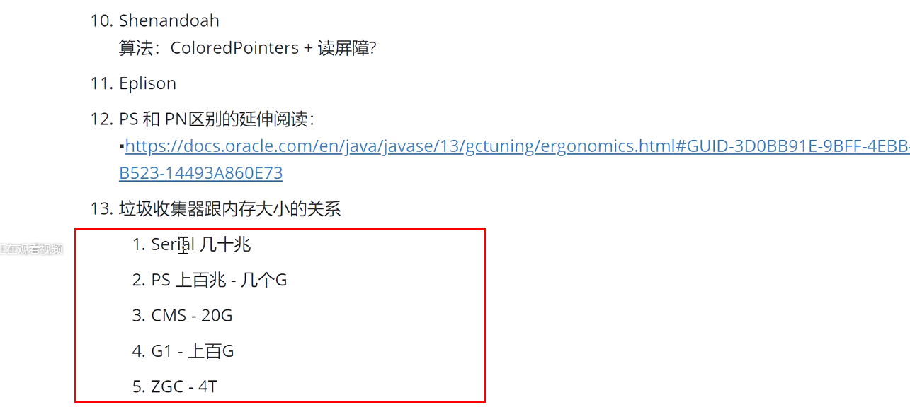
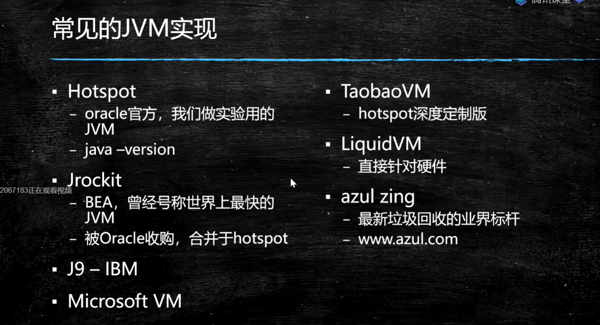
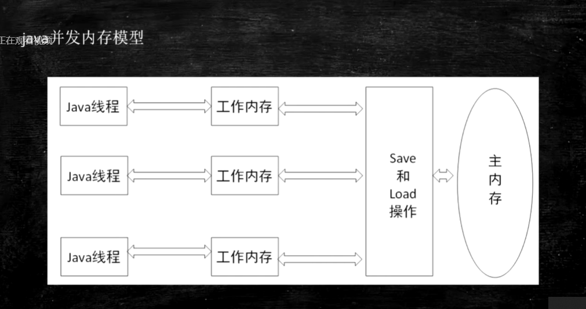
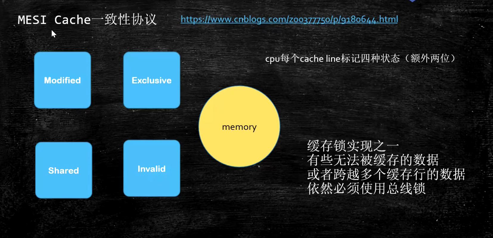
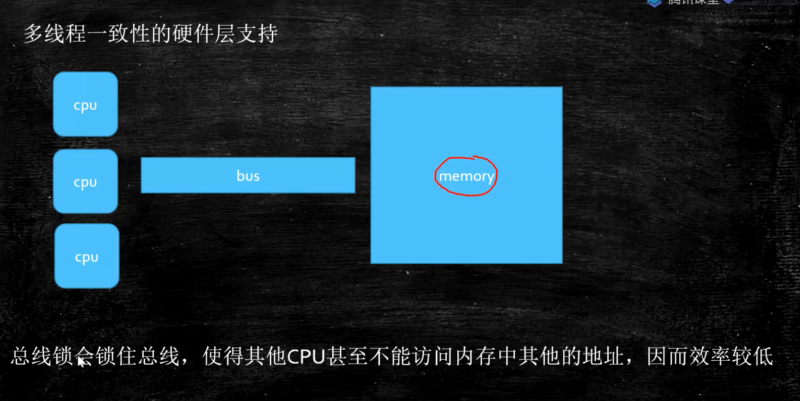
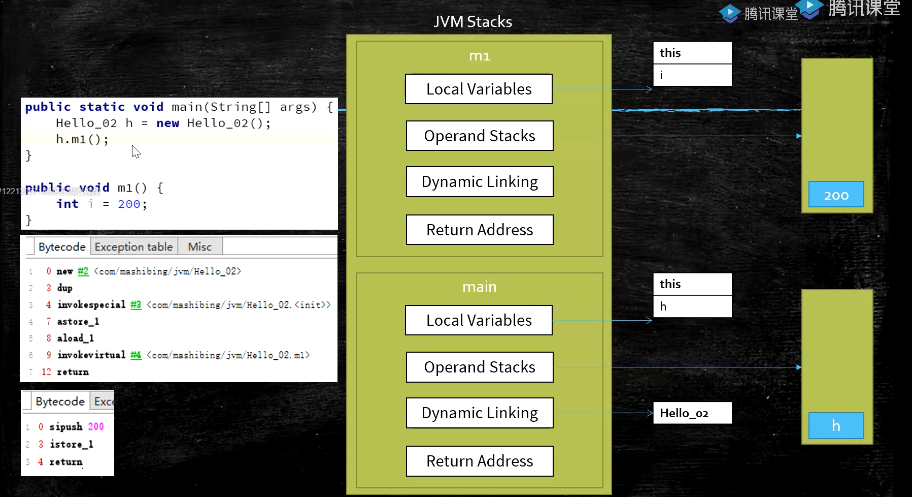

---

---

# JVM 虚拟机 


## GC 基础知识

1.什么是垃圾(垃圾的定义)?

  不同语言申请和释放内存的实现

语言          申请内存                    释放内存

C                malloc                           free

C++            new                              delete

Java           new                               ? 自动回收

自动回收垃圾的好处? 

	1. 编程简单, 2. 系统不易出错

手动回收常见问题:

​	1.忘记回收(内存泄漏) , 2.多次回收(会出错)

 垃圾: 没有任何 根引用(root) 指向的 一个/多个(循环引用) 的对象

垃圾判别常见的算法:

​	1.引用计数法, 循环引用问题不能解决(python使用)

​	2.根可达算法(Java使用), 有向图 dfs 或者 bfs 来实现

什么是根对象: 线程栈变量 + 静态变量 + 常量池 + JNI 指针(?)

原文: which instances are roots?

answer: jvm stack, native method stack, run-time constant pool, static references in method area, clazz


常见垃圾回收算法

	1. 标记清除(mark-sweep): 内存不连续,产生内存碎片
	2. 复制算法(copying): 占空间,性能好,无碎片
	3. 标记压缩(mark-compact): 效率低,没碎片, 不占空间


JVM内存分代模型 (部分垃圾回收器使用)

新生代(young)  +  老年代(old)  + 永久代(permanent : 1.7) /  元数据区(metadata space : 1.8)

永久代和元数据区的异同:

1.都存class类对象

2.永久代必须指定大小限制(存在内存不够), 元数据去可设可不设,,无上限(受限于系统物理内存)

3.字符串常量池: 1.7 存永久代 1.8 存堆内存(heap)

4.方法区(method area)是逻辑概念, 1.7 对应 永久代, 1.8 对应 元数据区

5.永久代放堆内存(由JVMd对该部分进行内存管理), 元数据区 内存由操作系统管理(不受JVM管理)


对象创建 & 对象存储位置 & 垃圾回收:

1. new对象, 进入eden区,若对象太大, 直接进入 tenured 区
2. 首次 YGC(minor GC): 大多数对象会被回收, 存活对象会进行S0区, 若对象太大,直接进入tenured区
3. 再次 YGC, 将 eden + S0 存活对象复制到 S1区
4. 再次 YGC, 将 eden + S1 存活对象复制到 S0区
5. 重复步骤 3,4, 每进行一次GC, 对象年龄 +1, 达到年龄阈值(默认15/CMS:6 , 可设置),进入老年代
6. 老年代(顽固分子) 满, FGC(major GC), 会回收 年轻代 + 老年代


GC tunning: GC调优(分代调优)

目标:减少FGC, 减少STW时间(Stop the World)


垃圾回收器: 


1. Serial / Serial Old 单线程串行 STW

   

2. Parallel Scvenge / Parallel Old 多线程并行 STW

   PS吞吐量优先, PN响应时间优先

   吞吐量 = 执行代码时间 / 总时间 (执行代码时间+ STW) 

3. ParNew + CMS (ConcurrentMarkSweep) + Serial Old

   CMS : 并发, 标记清除算法, 一般配合ParNew 及 Serial Old使用, ParNew可配合CMS , PS不能, 

   CMS缺点:易产生内存碎片, 不能回收浮动垃圾, 若CMS停止工作, Serial Old开始工作(极慢)

   初始标记: 标记roots, 单线程,STW, 标记对象少, 时间很短.

   并发标记: 使用根可达算法标记 多线程 标记可达对象.

   重新标记: STW ,多线程标记 并发标记阶段 参数的对象

   并发清理: 清理垃圾, 同时在此期间会产生浮动垃圾, 只能等待下一次垃圾回收时清理.

   

   

4. G1

5. xxx




-XX:ConcGCThreads=1 
-XX:G1ConcRefinementThreads=4 
-XX:GCDrainStackTargetSize=64 
-XX:InitialHeapSize=515777856 
-XX:MarkStackSize=4194304 
-XX:MaxHeapSize=8252445696 
-XX:MinHeapSize=6815736 
-XX:+PrintCommandLineFlags 
-XX:ReservedCodeCacheSize=251658240 
-XX:+SegmentedCodeCache 
-XX:+UseCompressedClassPointers 
-XX:+UseCompressedOops 
-XX:+UseG1GC 

能力欠缺 
|----阅读源码的能力, 快速了解API的能力.
|----测试模拟线上环境的能力,并根据情况进行调优.

软件工程职位分工:
|----后端程序员
|----前端程序员
|----测试
|----运维


## class文件结构


## 类加载过程


### loading 加载

​	将class文件加载到内存(方式可多种多样,如class文件,zip文件等)

​	JVM规范未规定何时加载,但规定以下情况必须加载:

	1. new, getStatic , putStatic , invoke_static 指令, 访问final 变量除外
	2. java.lang.reflect对类进行反射时调用时
	3. 初始化子类, 父类线初始化
	4. 虚拟机启动时, 被执行的主类必须初始化
	5. 动态语言支持java.lang.invoke.MethodHandle解析结果为Ref_getStatic, Ref_putStaic, ref_invokeStatic的方法句柄时, 该类必须被初始化.

### liking 连接

#### 	verification

​		验证class文件是否符合JVM规范

#### 	preparation

​		静态变量设置默认值

#### 	resolution

​		将类,方法,属性等符号引用解析为直接引用, 将常量池中的各种符号引用解析为为指针,偏移量等内存地址的直接引用

### initializing 初始化

​	调用类初始方法<cinit>,  将静态变量赋初始值


类加载到内存是创建了两个对象. 一个是class文件的二进制字节流, 一个是class对象, class对象指向 二进制字节流对象


双亲委派模型

​	类加载器首先将加载过程委托给父加载器去加载,父加载器不能加载再自己加载

​	作用:安全, 防止自己写的类覆盖jdk原有的类,实现数据窃取等问题.

​	不同classloader加载的class文件不相等.

​	父加载器 不是 父类加载加载器,他们不是继承关系

​	加载路径 (具体见Lanucher类)  boostrap: sun.boot.class.path;  extension: java.ext.dirs ;  app: java.class.path 

​	自定义类加载器,只需实现findClass方法(模板方法)

​	**待做: 自定义ClassLoader, 实现 Jar文件加密**


Java执行过程的三种模式

编译执行: 将class bytecode编译为本地代码执行, 启动慢,执行快,  -XComp

解释执行: 再执行过程中把 bytecode解释为本地代码执行, 启动快,执行慢, -Xint

混合模式: 刚开始解释执行,对热点代码(执行次数多的方法或代码块)编译为本地代码(Hot Spot由来) -Xmixed




### JMM  Java Memory Model  java内存模型




数据一致性问题(L1,L2数据不共享)

1.总线锁 (Bus Lock) 效率低

2.缓存一致性协议 (MESI --> 应用于缓存行)

缓存行: 为提高效率, 按整行读取,一般64字节

cpu乱序执行: cpu为提高效率,会在一条指令执行过程中去同时执行另一条指令,前提是两条指令无依赖关系(主要原因是cpu读取速度比内存快100倍)

合并写: wcBuffer, 介于L1与CPU之间


#### 有序性保障

硬件层面(x86):

CPU内存屏障 

sfence (save fence):  sfence前后的写操作不能重排

lfence (load fence): lfence前后读前后不能重排

mfence: mfence前后的读写操作都不能重排

cpu原子指令: lock , 一般在别的指令前加 






JVM层级

四种屏障:

loadload ,  storestore,  loadstore , storeload


volatile实现细节:

1.字节码层级: ACC_VOLATILE

2.JVM层面: 操作前后加屏障

3.OS和硬件层面:  Linux看具体的虚拟机实现,(可使用hsdis工具查看源码 <--> hotspot Dis Assember ) , windows使用lock指令实现


synchronized实现细节:

1.字节码层面: ACC_SYCHRONIZED 或 moniterenter / moniterexit指令(一个moniterenter和两个moniterexit指令)

2.JVM层面: C/C++调用操作系统提供的同步机制

3.OS和硬件层面: lock+指令+其他(x86)


对象内存布局

对象创建过程: 

1.class loading

2.class linking:  (1). verification.  (2).preparation. (3)resolution

3.class intializing

4.申请对象内存

5.成员变量赋默认值

6.调用构造方法<init> : (1). 成员变量顺序赋初始值 (2).执行构造方法语句


对象在内存中的存储布局

普通对象:

1.对象头(markword 8字节):

2.classPointer指针: -XX: +useCompressedClassPointer (压缩4字节,不压缩8字节)

3.实例数据: (1):基本类型 (2):应用类型: -XX:+useCompressOops (压缩为4字节,不压缩为8字节)

4.padding对齐: 对齐使得对象所占内存为8的倍数

备注: Oops: Ordinary Object Pointers 观察虚拟机参数: java  -XX:+printCommandLineFlags -version


数组对象:

1.对象头

2.ClassPointer

3.数组长度 4字节

4.数据数据

5.padding对齐


对象头内容:


对象定位: 

1.句柄池: 效率低,GC效率高,  引用指向句柄对象, 句柄对象包含两个指针, 一个指向类对象, 一个指向实例对象

2.直接指针: hotspot使用, 效率高,GC效率低, 引用执行实例对象, 实例对象中包含类对象


对象如何分配

 


Java运行时数据区和指令集

Runtime Data Area

PC: 存放指令位置, 线程独有

虚拟机的运行:伪代码

```java
while(not end){
	取pc值,找对应指令;
	执行指令;
	PC++;
}
```


方法中bytecode中的表示: 局部变量表 + 字节码 + 杂项 + 异常表 ;  字节码将数据 在局部变量表和操作数栈中进行操作.

虚拟机栈:

栈帧: 局部变量 + 操作数栈 + 动态链接 + 返回地址

一个方法对应一个栈帧, 一个虚拟机栈包含多个栈帧

指令集实现方式: 基于栈的指令集 和 基于寄存器


解析字节码执行方式

invoke_static 静态方法

invoke_virtual 自带多态

invoke_special: 执行可直接定位,不需要多态的方法 private, <init>

invoke_interface: 通过 interface 调用

invoke_dynamic: lamda表达式中会使用,反射/其他动态语言,动态产生的class会用到此指令,lambda会产生很多动态类


部分字节码解释:

load  将 数据 从 本地变量表 压入 栈

store 将 数据 从 栈 弹出 并赋值到 本地变量表

push 是将  常量 压入 栈 

getField 将引用 弹出栈  并将 field值获取到并压入栈

add/multi/xxx 是将两个数弹出栈做完运算后将结果鸭压入栈

ldc 将常量池的数据压入栈

方法执行 invoke_xxx  过程是 将方法所属类引用 ,所需参数 弹出栈 并新启一个栈帧 来执行




JVM Tunning

查看java命令含义

java -X : 查看-X的命令


命令:

-Xmn10M  设置新生代大小

-Xms10M 设置最小堆大小

-Xmx10M 设置最大堆大小 (备注: 一般最好将 最小堆大小和最大堆大小设置一样, 不用操作系统去计算什么时候扩容什么时候减少容量)

 -XX:+PrintCommandLineFlags   查看启动参数

-XX:+PrintGC 打印GC内容

在T01_HelloGC中设置启动参数: -Xmn10M -Xms40M -Xmx60M -XX:+PrintCommandLineFlags -XX:+PrintGC

```java
package com.mashibing.jvm.c5_gc;
//-XX:+PrintGCDetails -XX:+UseConcMarkSweepGC -XX:+PrintFlagsFinal -XX:+PrintVMOptions -
public class T01_HelloGC {
    public static void main(String[] args) {
		//需要1000M内存,无法分配下
        for(int i=0; i<10000; i++) {
            byte[] b = new byte[1024 * 1024];
        }
    }
}
```

打印日志如下

```
-XX:InitialHeapSize=20971520 -XX:MaxHeapSize=20971520 -XX:MaxNewSize=10485760 -XX:NewSize=10485760 -XX:+PrintCommandLineFlags -XX:+PrintGC -XX:+UseCompressedClassPointers -XX:+UseCompressedOops -XX:-UseLargePagesIndividualAllocation -XX:+UseParallelGC 
[GC (Allocation Failure)  1679K->784K(19456K), 0.0010647 secs]
[GC (Allocation Failure)  784K->800K(19456K), 0.0009715 secs]
[Full GC (Allocation Failure)  800K->594K(19456K), 0.0034400 secs]
[GC (Allocation Failure)  594K->594K(19456K), 0.0002646 secs]
[Full GC (Allocation Failure)  594K->577K(19456K), 0.0045077 secs]

GC/Full GC : GC类型还是YGC还是FullGC
(Allocation Failure) : 原因, 分配失败
1679K -> 784K(19456K) 8167K回收前内存, 752K回收后内存,19456K总的堆内存
0.0006316 secs 耗时


```

