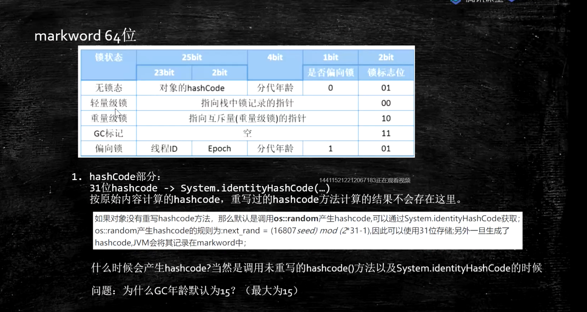

# JVM  相关知识

## 类加载过程


### 1: loading 加载

​	将class文件加载到内存(方式可多种多样,如class文件,zip文件等)

​	JVM规范未规定何时加载,但规定以下情况必须加载:

	1. new, getStatic , putStatic , invoke_static 指令, 访问final 变量除外
	2. java.lang.reflect对类进行反射时调用时
	3. 初始化子类, 父类线初始化
	4. 虚拟机启动时, 被执行的主类必须初始化
	5. 动态语言支持java.lang.invoke.MethodHandle解析结果为Ref_getStatic, Ref_putStaic, ref_invokeStatic的方法句柄时, 该类必须被初始化.

### 2: liking 连接

#### 	(1: verification

​		验证class文件是否符合JVM规范

#### 	(2: preparation

​		静态变量设置默认值

#### 	(3: resolution

​		将类,方法,属性等符号引用解析为直接引用, 将常量池中的各种符号引用解析为为指针,偏移量等内存地址的直接引用

### 3: initializing 初始化

​	调用类初始方法<cinit>,  将静态变量赋初始值

类加载到内存是创建了两个对象. 一个是class文件的二进制字节流, 一个是class对象, class对象指向 二进制字节流对象


### 双亲委派模型

​	类加载器首先将加载过程委托给父加载器去加载,父加载器不能加载再自己加载

​	作用:安全, 防止自己写的类覆盖jdk原有的类,实现数据窃取等问题.

​	不同classloader加载的class文件不相等.

​	父加载器 不是 父类加载加载器,他们不是继承关系

​	加载路径 (具体见Lanucher类)  boostrap: sun.boot.class.path;  extension: java.ext.dirs ;  app: java.class.path 

​	自定义类加载器,只需实现findClass方法(模板方法)

​	**待做: 自定义ClassLoader, 实现 Jar文件加密**


### Java执行过程

1: 编译执行: 将class bytecode编译为本地代码执行, 启动慢,执行快,  -XComp

2: 解释执行: 再执行过程中把 bytecode解释为本地代码执行, 启动快,执行慢, -Xint

3: 混合模式: 刚开始解释执行,对热点代码(执行次数多的方法或代码块)编译为本地代码(Hot Spot由来) -Xmixed


## JMM  Java Memory Model


存储器层级结构:


数据一致性问题(L1,L2数据不共享)

1.总线锁 (Bus Lock) 效率低

2.缓存一致性协议 (MESI --> 应用于缓存行)

缓存行: 为提高效率, 按整行读取,一般64字节

cpu乱序执行: cpu为提高效率,会在一条指令执行过程中去同时执行另一条指令,前提是两条指令无依赖关系(主要原因是cpu读取速度比内存快100倍)

合并写: wcBuffer, 介于L1与CPU之间


有序性保障:

硬件层面(x86):

CPU内存屏障 

sfence (save fence):  sfence前后的写操作不能重排

lfence (load fence): lfence前后读前后不能重排

mfence: mfence前后的读写操作都不能重排

cpu原子指令: lock , 一般在别的指令前加 


Java内存模型


JVM层级

四种屏障:

loadload ,  storestore,  loadstore , storeload


volatile实现细节:

1.字节码层级: ACC_VOLATILE

2.JVM层面: 操作前后加屏障

3.OS和硬件层面:  Linux看具体的虚拟机实现,(可使用hsdis工具查看源码 <--> hotspot Dis Assember ) , windows使用lock指令实现


synchronized实现细节:

1.字节码层面: ACC_SYCHRONIZED 或 moniterenter / moniterexit指令(一个moniterenter和两个moniterexit指令)

2.JVM层面: C/C++调用操作系统提供的同步机制

3.OS和硬件层面: lock+指令+其他(x86)


#### 对象创建过程: 

1.class loading

2.class linking:  (1). verification.  (2).preparation. (3)resolution

3.class intializing

4.申请对象内存

5.成员变量赋默认值

6.调用构造方法<init> : (1). 成员变量顺序赋初始值 (2).执行构造方法语句


#### 对象在内存中的存储布局

普通对象:

1.对象头(markword 8字节):

2.classPointer指针: -XX: +useCompressedClassPointer (压缩4字节,不压缩8字节)

3.实例数据: (1):基本类型 (2):应用类型: -XX:+useCompressOops (压缩为4字节,不压缩为8字节)

4.padding对齐: 对齐使得对象所占内存为8的倍数

备注: Oops: Ordinary Object Pointers 观察虚拟机参数: java  -XX:+printCommandLineFlags -version


数组对象:

1.对象头

2.ClassPointer

3.数组长度 4字节

4.数据数据

5.padding对齐


对象头内容:





#### 对象定位: 

1.句柄池: 效率低,GC效率高,  引用指向句柄对象, 句柄对象包含两个指针, 一个指向类对象, 一个指向实例对象

2.直接指针: hotspot使用, 效率高,GC效率低, 引用执行实例对象, 实例对象中包含类对象

 


### Java运行时数据区和指令集

Runtime Data Area: 


PC: 存放指令位置, 线程独有

虚拟机的运行:伪代码

```java
while(not end){
	取pc值,找对应指令;
	执行指令;
	PC++;
}
```


方法中bytecode中的表示: 局部变量表 + 字节码 + 杂项 + 异常表 ;  字节码将数据 在局部变量表和操作数栈中进行操作.

虚拟机栈:

栈帧: 局部变量 + 操作数栈 + 动态链接 + 返回地址

一个方法对应一个栈帧, 一个虚拟机栈包含多个栈帧

指令集实现方式: 基于栈的指令集 和 基于寄存器


解析字节码执行方式

invoke_static 静态方法

invoke_virtual 自带多态

invoke_special: 执行可直接定位,不需要多态的方法 private, <init>

invoke_interface: 通过 interface 调用

invoke_dynamic: lamda表达式中会使用,反射/其他动态语言,动态产生的class会用到此指令,lambda会产生很多动态类


部分字节码解释:

load  将 数据 从 本地变量表 压入 栈

store 将 数据 从 栈 弹出 并赋值到 本地变量表

push 是将  常量 压入 栈 

getField 将引用 弹出栈  并将 field值获取到并压入栈

add/multi/xxx 是将两个数弹出栈做完运算后将结果鸭压入栈

ldc 将常量池的数据压入栈

方法执行 invoke_xxx  过程是 将方法所属类引用 ,所需参数 弹出栈 并新启一个栈帧 来执行


线程/协程

启用线程: JVM(用户态申请新增线程)  -> Kernel 新增线程 (需消耗大量系统资源 约1M)

启用协程: JVM申请新增协程  , 不用切换到内核态 , 所需资源少. 


面试题:

1.解释下对象的创建过程?

2.对象在内存中的存储布局?

3.对象头具体包括什么?

4.对象怎么定位?

5.对象怎么分配?

6.Object o = new Object() 在内存中占多少字节?


Class文件结构

见jvms

