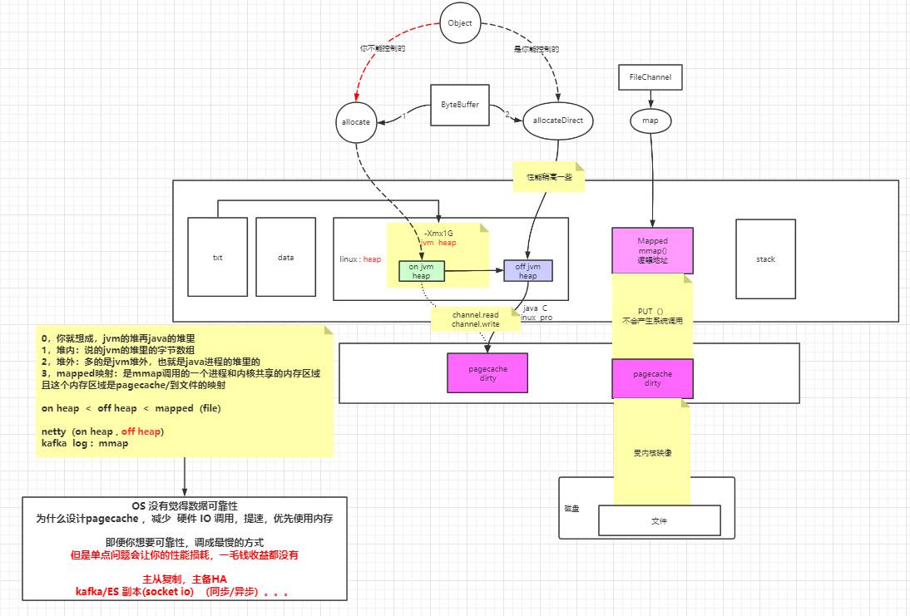
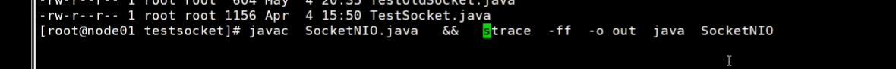

# 内存与IO (磁盘IO,网络IO)

脉络: linux文件树 ->  socket -> BIO -> NIO -> Selector -> Netty -> RPC -> 

第一节课: 虚拟文件系统,文件描述符, IO重定向

## 磁盘IO

Kernel: Linux内核程序, 系统态

VFS: 在Kernel中的树状结构, 不同文件映射到不同的物理设备, 解耦

inode: 文件的id

pageCache: 程序访问文件,会将文件读取到内存, 称为PageCache 4K ,

dirty: 修改过PageCache中的数据,标记为dirty.

flush: 将dirty的PageCache刷新到物理文件中. 何时刷新? 可由 app/kernel决定,可能存在数据丢失,PageCache中的数据为flush到磁盘,断电

FD: 文件描述符,程序使用, 不同APP需维护各种的seek(指针)

挂载: 将虚拟文件映射到物理文件

df: 查看挂载情况

umount /boot :  卸载 挂载虚拟文件

mount /dev/sda1 /boot 将物理文件挂载到虚拟文件


一切皆文件: I/O

文件类型:

－: 普通文件,可执行,文本,图片

d : 文件夹

b : 块设备 (可只有漂移读)

c : 字符设备(不能前后漂移读,键盘)

s : socket 

p : pipeline 管道 

l : 链接 (软链接A->B->F,硬链接: A->F, B->F)   ln -s  /a  /b

软链接inode号不一样, 硬链接inode号一样

[eventpoll] : 


重定向  

<  : 输入 >: 输出,  <>后面接文件描述符时需要加&

exec 8< /etc/local/abc.txt : 将abc.txt重定向到8这个文件描述符

ls ./ 1> /usr/local/ls.out  将当前ls打印的文件重定向到ls.out文件

cat 0<oxx.txt 1>cat.out

grep | 管道 : 左边的输出作为右边的输入

父子进程: 进程隔离,父进程的变量子进程不能查看, 

export xx  父进程的变量子进程可以查看

{ } 代码块, 在同一进程执行

| 先启用一个子进程执行管道左边的命令,在启用一个子进程执行管道右边的命令

$$ 的优先级高于管道, $BASHPID 优先级低于管道

任何文件都有 0 1 2 文件描述符

0: 标准输入

1: 标准输出

2: 错误输出

lsof -op $$ : 查看程序打开了那些文件

pcstat $$ : PageCache State,  备注: pcstat需安装go语言环境, 等等

swap: 交换分区, 磁盘中,当内存中程序不使用时,且内存放不下,会将程序的数据放入交换分区

pageCache是内核维护的中间层, 

使用多大内存? 尽量将page Cache保存在内存中是否淘汰? 是否延时?是否丢数据?

数据写入文件不会立即保存,存在3种策略: 

```
sysctl -a | grep dirty : 查看配置项
vm.dirty_background_bytes = 0
vm.dirty_background_ratio = 10
vm.dirty_bytes = 0
vm.dirty_expire_centisecs = 3000
vm.dirty_ratio = 30
vm.dirty_writeback_centisecs = 500
vm.dirtytime_expire_seconds = 43200
修改
vim /etc/sysctl.conf
```

buffered IO 与 普通IO 相比为什么快? (系统调用)

buffered IO  , write 后满 8K后产生一次系统调用

普通IO, 每write一次产生一次系统调用

mmap :  不用参数系统调用就能将数据同步到pageCache




## 网络IO

命令:  

lsof -p 

netstat -natp

tcpdump


socket: 四元组 ,连接唯一

tcp: 面向连接的,可靠的协议 

三次握手, 窗口机制

```
ServerSocket server = new ServerSocket();
//kernel会创建一个Socket,用于Listen,同时也会有FD
//此时若客户端连接上服务端, kernel会完成三次握手,并创建socket(开辟资源),并接受数据
server.bind(new IntetSocketAddress("localhost",9090));

//进程为Kernel Socket 分配 FD, Client是FD的一种表示
Socket client = server.accept();

```


系统角度:

内存　＋ CPU  + IO设备(磁盘,网卡,字符设备,)

APP角度:


1.内存与IO的关系

2.文件系统中的IO


网络IO

socket

磁盘IO


饭要一口一口吃,路要一步一步走.




窗口机制 : ack 返回时带网卡还有的空间, 防止拥塞和数据丢失

MTU : 数据包大小

MSS : 实际数据大小


NIO 的N两个维度: 1.JDK　new IO    2.os  non-bloking


BIO:  两次阻塞, accpet , recv

NIO: 非阻塞,但每次recv都要产生系统调用

SELECT / POLL : 一次系统调用获取所有readable的fd, 但在kernel仍然存在 传入fds 和 对fds的循环遍历

EPOLL : 只需调用一次epoll_wait即可获取readable 的fds.

