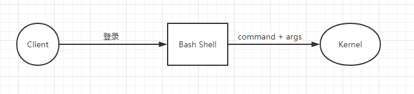

# Linux命令

#### Linux网络配置

网卡文件位置:　cd /etc/sysconfig/network-scripts/   

网卡文件: ifcfg-xxx xxx为网卡名; if -> interface      cfg ->configuration      eth -> etherne(以太网)

有线网卡文件

```apl
TYPE="Ethernet"
PROXY_METHOD="none"
BROWSER_ONLY="no"
DEFROUTE="yes"
IPV4_FAILURE_FATAL="no"
IPV6INIT="yes"
IPV6_AUTOCONF="yes"
IPV6_DEFROUTE="yes"
IPV6_FAILURE_FATAL="no"
IPV6_ADDR_GEN_MODE="stable-privacy" 
NAME="enp7s0"                                #
UUID="2b375401-97ee-400d-a5b7-a761cc06b88b"  #唯一编码
DEVICE="enp7s0"                              #设备名
BOOTPROTO="static"  						 #dhcp 表示动态获取IP地址, 为dhcp时不需要填下面信息
ONBOOT="yes"    							 #设备启动时激活网卡
IPADDR="192.168.1.120"                       #IP地址
GATEWAY="192.168.1.1"                        #网关
NETMASK="255.255.255.0"                      #掩码
DNS1="192.168.1.1"                           #DNS1
DNS2="192.168.1.1"                           #DNS2
```

无线网卡文件(wifi)

```
ESSID=Zero
MODE=Managed
KEY_MGMT=WPA-PSK
SECURITYMODE=open
MAC_ADDRESS_RANDOMIZATION=default
TYPE=Wireless
PROXY_METHOD=none
BROWSER_ONLY=no
BOOTPROTO=static
IPADDR=192.168.1.120
GATEWAY=192.168.1.1
DNS1=221.13.30.242
DEFROUTE=yes
IPV4_FAILURE_FATAL=no
IPV6INIT=yes
IPV6_AUTOCONF=yes
IPV6_DEFROUTE=yes
IPV6_FAILURE_FATAL=no
IPV6_ADDR_GEN_MODE=stable-privacy
NAME=Zero
UUID=b3f2bde5-b85a-4973-af22-b2f102d9f2da
ONBOOT=yes
```

需在当前文件创建key-Zero  备注:Zero为wifi名

```
WPA_PSK=password
```


#### bash shell




当Linux启动后, 客户端通过密码和账号登录进入 bash shell程序, 即我们我们看到的Linux界面, bash shell 将我们输入的 命令 + 参数 交由内核来处理.

Linux命令分为内部和外部命令, 内部命令时bash shell自带的命令, 外部命令时有用户安装的命令

输入命令+参数后执行顺序: 

>1: 输入 command + args , 按下回车键
>
>2: type command 判断时外部命令还是内部命令
>
>3: 若为内部命令, bash shell 直接运行命令
>
>4: 若为外部命令, 去hash 中查找是否有缓存命令执行文件.
>
>5: 若hash中无缓存执行文件, 去 PATH 变量所在目录查找命令的可执行文件
>
>6: 执行外部命令的可执行文件
>
>7: 执行可执行文件时bash shell 交由kernel去执行

#### 基础命令

type cd  :  查看cd命令时内部还是外部命令

echo $PATH : echo 以标准输出打印,  $PATH 变量名 

man cd : 解释cd 命令的含义及用法 (适用与内部和外部命令,  空格: 向下翻页, b:向上翻页, enter: 向下一行, q: 退出 )

help cd : 解释cd命令的含义及用法 (适用于内部命令), 一般外部用man , 内部用help

hash  : 查询哪些命令在缓存中

file txt  :  查看txt文件类型

whereis txt: 查看txt文件位置

ps -ef :  打印进程信息

ln txt xxoo : 为txt创建xxoo的硬链接, 即 两个文件指向同一磁盘文件

ln -s txt xxoo : 创建软连接 , xxoo -> txt -> 磁盘文件

stat txt : 查看文件详细信息

>modify :  内容最后一次修改时间
>
>change : 最后一次修改时间( 内容 + 权限等)

touch txt : 若无txt文件,则创建, 若有, 将access, modify, change时间统一, 可根据此 来查看是否有 增量数据 

mv  file1 file2 : 移动/重命名  若file2是文件, 就是重命名

mkdir -p aa/bb : 创建文件夹

rm txt : 删除文件

| 管道 :  man less | tail -5   ,  管道左边作为标准输出  , 管道右边将左边的输出作为标准输入, 即相当于 左边的输出是右边命令的参数

xargs : 配合管道使用, 若右边命令无法接收 左边标准输出的内容, 使用xargs, 如 echo "/" | ls -al 无法打印根目录下的内容, 使用echo "/" | xargs ls -al

scp username@hostname:filepath  filepath : 远程复制

grep redis cat txt :  后面接正则表达式 , 打印匹配redis 的行

正则表达式

>
>
>

#### 文本相关命令

cat xxoo ooxx : 将一个/多个 文件以标准输出形式打印出来

more xxoo : 支持分页(空格, enter), 若看完,则退出,不能回看,往上查看等

less  xxoo : 支持回看(b), 将内容加载到内存(不是全部加载到内存)

head/tail -5 txt : 读取txt前/后 5行, 并打印到标准输出设备上.


#### 定义变量方式

定义变量: a=1

定义数组: arr=(1 2 3)         空格隔开

打印第一个: echo $arr

打印第二个:echo ${arr[1]} 

$$ : bash shell的pid  , echo $$

$BASHPID : ????	可能于echo $$打印的信息不一样


#### Linux文件系统

> Linux将文件进行抽象, 实现文件与磁盘等设备的解耦

Linux目录结构及含义

>bin : 用户相关命令存放位置
>
>sbin : 管理相关命令存放位置
>
>boot : 系统启动相关文件
>
>dev : 存放设备文件( 鼠标, 键盘,打印机等设备文件 )
>
>home :　用户家目录，若由一个zero用户, home下会再创建一个zero文件夹存放zero的相关信息
>
>root : 管理员的家目录
>
>lib : 库文件( 操作系统和第三方软件库文件存放位置)
>
>lib64 :  ???
>
>media : 挂载点目录, 移动设备??? 那些时移动设备???
>
>mnt : 挂载点目录, 额外的临时文件系统, 如移动硬盘
>
>opt : 第三方软件安装目录, 我们平时需要安装的软件应该放这个位置
>
>proc : 伪文件系统, 内核映射文件???
>
>sys :  伪文件系统, 跟硬件相关属性的映射文件???
>
>tmp : 临时文件
>
>var : 可变化文件, 如日志,需要处理的日志
>
>etc : 
>
>usr : 
>
>run : 

一般磁盘由boot, swap , 其他, boot存放引导文件, swap交换文件存放位置, 一般将程序存放内存当中, 当需切换进程/线程, 内存空间不能同时存放上一个进程/线程的信息 和 当前执行进程的 信息, 就需将上一个进程 内容 存放到 swap磁盘中, 恢复进程时从磁盘中加载到内存然后执行. 

df -h  /root  :  打印磁盘分区使用相关信息 (tmpfs : swap ; )

du -h  /root : 打印文件夹使用相关信息

ls 或者 ll : 打印文件夹下的文件/文件夹信息 

```
drwxr-xr-x.  4 root root    34 Dec 27 17:16 src
lrwxrwxrwx.  1 root root    10 Dec 27 17:16 tmp -> ../var/tmp
以第一行为例: 
d    : 文件类型
rwx  : owner权限
r-x  : owner'group 权限
r-x  : other权限
.    : 分割符
4    : 引用次数(硬链接)
root : owner
root : owner's group
34   : size (单位k)

文件类型:
-    : 普通文件
d    : 文件夹
l    : 软链接
b    : 块设备文件(可往前往后移动的读)
c    : 字符设备(只能读当前, 如键盘)
p    : pipeline 管道文件
s    : socket 套接字文件

权限解释:
w    : write 写
r    : read 读
x    : 执行
-    : ??
```

####                     

​                                                                                                                                                                                                                                                                                                                                                                                                                                                                                                                                                                                                                                                                                                                                                                                                                                                                                                                                                                                                                                                                                                                                                                                                                                                                                                                                                                                                                                                                                                                                                                                                                                                                                                                                                                                                                                                                                                                                                                                                                                                                                                                                                                                                                                                                                                                                                                                                                                                                                                                                                                                                                                                                                                                                                                                                                                                                                                                                                                                                                                                                                                                                                                                                                                                                                                                                                                                                                                                                                                                                                                                                                                                                                                                                                                                                                                                                                                                                                                                                                                                                                                                                                                                                                                                                                                                                                                                                                                                                                                                                                                                                                                                                                                                                                                                                                                                                                                                                                                                                                                                                                                                                                                                                                                                                                                                                                                                                                                                                                                                                                                                                                                                                                                                                                                                                                                                                                                                                                                                                                                                                                                                                                                                                                                                                                                                                                                                                                                                                                                                                                                                                                                                                                                                                                                                                                                                                                                                                                                                                                                                                                                                                                                                                                                                                                                                                                                                                                                                                                                                                                                                                                                                                                                                                                                                                                                                                                                                                                                                                                                                                                                                                                                                                                                                                                                                                                                                                                                                                                                                                                                                                                                                                                                                                                                                                                                                                                                                                                                                                                                                                                                                                                                                                                                                                                                                                                                                                                                                                                                                                                                                                                                                                                                                                                                                                                                                                                                                                                                                                                                                                                                                                                                                                                                                                                                                                                                                                                                                                                                                                                                                                                                                                                                                                                                                                                                                                                                                                                                                                                                                                                                                                                                                                                                                                                                                                                                                                                                                                                                                                                                                                                                                                                                                                                                                                                                                                                                                                                                                                                                                                                                                                                                                                                                                                                                                                                                                                                                                                                                                                                                                                                                                                                                                                                                                                                                                                                                                                                                                                                                                                                                                                                                                                                                                                                                                                                                                                                                                                                                                                                                                                                                                                                                                                                                                                                                                                                                                                                                                                                                                                                                                                                                                                                                                                                                                                                                                                                                                                                                                                                                                                                                                                                                                                                                                                                                                                                                                                                                                                                                                                                                                                                                                                                                                                                                                                                                                                                                                                                                                                                                                                                                                                                                                                                                                                                                                                                                                                                                                                                                                                                                                                                                                                                                                                                                                                                                                                                                                                                                                                                                                                                                                                                                                                                                                                                                                                                                                                                                                                                                                                                                                                                                                                                                                                                                                                                                                                                                                                                                                                                                                                                                                                                                                                                                                                                                                                                                                                                                                                                                                               vim 文本编辑器

##### 模式切换

编辑 -> 输入 : a(append) 向后追加;  i(insert)向前插入;  o(other)另起一行

输入 -> 编辑 : esc

编辑 -> 末行 : 冒号:

##### 编辑模式

###### 移动光标

 >字符 :  h:左  j: 下 k: 上  l: 有
 >
 >单词 :  w e b ->   ward  end : 往后 词首/词尾  back: 反向 词首
 >
 >行内:  0 $ ^  -> 0: 行首, ^ : 非空白首 $ : 行尾
 >
 >行间:  g G:  gg : 文章开头,  G : 文章末尾  4G : 第四行
 >
 >翻页: ctrl + f / b    forward / back   

编辑

>删除 : x -> 删除光标处字符  3x : 删除3个字符   dw: 删除光标后单词, dd: 删除整行
>
>替换 : r  -> 替换光标处字符 , 例: ra -> 将光标所在字符替换a
>
>复制 :   yw: 复制光标后到单词结束的字符, yy: 复制整行
>
>粘贴 :  p 往后粘贴, P: 往前粘贴
>
>撤销 : u
>
>重做 : 重做
>
>.       :  重复上一步操作 
>
>总结: y: copy, p: paste, w: word, d: delete, 叠词表示整行, r : replace; x : 删除 

##### 输入模式

>正常打字输入

##### 末行模式 

>保存退出
>
>wq!     wq = x
>
>
>
>设置
>
>set nu / set number  ;  set nonu / set nonumber
>
>set readonly
>
>
>
>查找:  / ?
>
>/username : 查找username
>
>n N : 向上/下 查找
>
>?username :  查找username, nN 功能反过来了, 
>
>执行外部命令 
>
>!  ls -l  /usr/local : 打印信息
>
>
>
>替换
>
>s/aa/bb/gi   将aa替换为bb, 行内替换
>
>/  : 分隔符, 可为 / @ #
>
>g  : 整行所有匹配的单纯, 
>
>i  : 忽略大小写 
>
>
>
>移动光标
>
>范围:  n : 行号 , +n : 偏移行号,   . : 当前光标行首,  $ :　最后一行，　$-5: 倒数第五行 
>
>
>
>全文操作
>
>%s/aa/bb  : 将全文的aa都替换为bb


#### awk 文本分析工具

支持变量,函数,控制语句,脚本,非常强大

#### 用户与权限

用户和组信息保存位置:  /etc/passwd ;  /etc/group

文件权限: owner / group / other 三个层级

创建用户: useradd alex  , 会在/home和 /var/spool/mail 下创建 alex目录

更改密码: passwd alex 

删除用户: userdel alex , 需再/home 和/var/spool/mail 下删除 alex目录

查看用户信息: id alex

```
uid=1001(alex) gid=1001(alex) groups=1001(alex)
uid: 
gid: 初始时的group id
```

创建组 : groupadd mtfence 

更改属主 :  chown root:mtfence /share 将share文件夹owner修改为root, group修改为mtfence, -hR 子文件和文件夹权限也修改

更改权限 : chmod g+w /share 将share问价夹为group添加w的权限

> 用户: u: root  g: group o: other a: all , 权限: r w x   操作符: +  -  = 

修改用户mode:  usermod -G mtfence alex 将alex 添加到mtfence组中去


yum ? wget?? 源>???

### 常用命名

```
解压tar.gz文件
	tar -xzvf 
修改文件名 
	使用移动文件命令 mv fileA fileB 
创建文件夹
	mkdir dirName
创建文件
	touch fileName

```


**查找文件/文件夹**

whereis

find / -name filename*

systemctl status

systemctl start

systemctl restart

systemctl stop

rpm -ivh 安装

rpm -q 查看

rpm -e 卸载


安装方式区别?

yum 

apt

rpm

tar -xzvf 


### 防火墙 firewall

```
1、开放指定端口
      firewall-cmd --zone=public --add-port=1935/tcp --permanent
       命令含义：
           --zone #作用域
           --add-port=1935/tcp  #添加端口，格式为：端口/通讯协议
           --permanent  #永久生效，没有此参数重启后失效
2、开启防火墙 
    systemctl start firewalld

关闭防火墙
	s


3、重启防火墙 
	firewall-cmd --reload
	
	防火墙相关操作

1、开启防火墙 
    systemctl start firewalld

2、开放指定端口
      firewall-cmd --zone=public --add-port=1935/tcp --permanent
 命令含义：
--zone #作用域
--add-port=1935/tcp  #添加端口，格式为：端口/通讯协议
--permanent  #永久生效，没有此参数重启后失效

3、重启防火墙 
	firewall-cmd --reload

4、查看端口号
netstat -ntlp   //查看当前所有tcp端口·

netstat -ntulp |grep 1935   //查看所有1935端口使用情况·


```


RabbitMQ

下载RabbitMQ (RPM文件) 最新的3.8.9没有rabbitmq.config.example文件

​	https://www.rabbitmq.com/download.html

下载erlang(RPM文件)

​	https://www.erlang.org/downloads

下载两个rpm文件, 

rpm -ivh erlang.file.rpm

yum install -y rabbitmq-server.rpm

开启15672的管理配置 

rabbitmq-plugins enable rabbitmq_management

systemctl start/restart/stop rabbitmq-server

启动报错,查看日志

```
#systemctl status rabbitmq-server.service
rabbitmq-server.service - RabbitMQ broker
Loaded: loaded (/usr/lib/systemd/system/rabbitmq-server.service; disabled; vendor preset: disabled)
Active: activating (auto-restart) (Result: exit-code) since Sat 2020-12-12 10:06:42 CST; 6s ago
Process: 827374 ExecStart=/usr/sbin/rabbitmq-server (code=exited, status=1/FAILURE)
Main PID: 827374 (code=exited, status=1/FAILURE)
```

```
#journalctl -xe
-- Unit rabbitmq-server.service has begun starting up.
Dec 12 10:37:38 Gzzx rabbitmq-server[850438]: Configuring logger redirection
Dec 12 10:37:39 Gzzx rabbitmq-server[850438]: 10:37:39.136 [error]
Dec 12 10:37:39 Gzzx rabbitmq-server[850438]: 10:37:39.138 [error] BOOT FAILED
Dec 12 10:37:39 Gzzx rabbitmq-server[850438]: BOOT FAILED
Dec 12 10:37:39 Gzzx rabbitmq-server[850438]: 10:37:39.138 [error] ===========
Dec 12 10:37:39 Gzzx rabbitmq-server[850438]: ===========
Dec 12 10:37:39 Gzzx rabbitmq-server[850438]: 10:37:39.138 [error] ERROR: distribution port 25672 in use by another node: rabbit@Gzzx //备注:表示端口被占用
Dec 12 10:37:39 Gzzx rabbitmq-server[850438]: ERROR: distribution port 25672 in use by another node: rabbit@Gzzx
Dec 12 10:37:39 Gzzx rabbitmq-server[850438]: 10:37:39.138 [error]
Dec 12 10:37:40 Gzzx rabbitmq-server[850438]: 10:37:40.139 [error] Supervisor rabbit_prelaunch_sup had child prelaunch started with rabbit_prelaunch:run_prelaunch_first_phase() at undefined exit with reason {dist_port_already_used,25672,"ra>
Dec 12 10:37:40 Gzzx rabbitmq-server[850438]: 10:37:40.139 [error] CRASH REPORT Process <0.157.0> with 0 neighbours exited with reason: {{shutdown,{failed_to_start_child,prelaunch,{dist_port_already_used,25672,"rabbit","Gzzx"}}},{rabbit_pre>
Dec 12 10:37:41 Gzzx rabbitmq-server[850438]: {"Kernel pid terminated",application_controller,"{application_start_failure,rabbitmq_prelaunch,{{shutdown,{failed_to_start_child,prelaunch,{dist_port_already_used,25672,\"rabbit\",\"Gzzx\"}}},{r>
Dec 12 10:37:41 Gzzx rabbitmq-server[850438]: Kernel pid terminated (application_controller) ({application_start_failure,rabbitmq_prelaunch,{{shutdown,{failed_to_start_child,prelaunch,{dist_port_already_used,25672,"rabbit","Gzzx"}}},{rabbit>
Dec 12 10:37:41 Gzzx rabbitmq-server[850438]: [1B blob data]
Dec 12 10:37:41 Gzzx rabbitmq-server[850438]: Crash dump is being written to: erl_crash.dump...done
Dec 12 10:37:41 Gzzx systemd[1]: rabbitmq-server.service: Main process exited, code=exited, status=1/FAILURE
Dec 12 10:37:41 Gzzx systemd[1]: rabbitmq-server.service: Failed with result 'exit-code'.
Dec 12 10:37:41 Gzzx systemd[1]: Failed to start RabbitMQ broker.
-- Subject: Unit rabbitmq-server.service has failed
-- Defined-By: systemd
-- Support: https://access.redhat.com/support
-- 
-- Unit rabbitmq-server.service has failed.
-- 
-- The result is failed.
Dec 12 10:37:51 Gzzx systemd[1]: rabbitmq-server.service: Service RestartSec=10s expired, scheduling restart.
Dec 12 10:37:51 Gzzx systemd[1]: rabbitmq-server.service: Scheduled restart job, restart counter is at 74.
-- Subject: Automatic restarting of a unit has been scheduled
-- Defined-By: systemd
-- Support: https://access.redhat.com/support
-- 
-- Automatic restarting of the unit rabbitmq-server.service has been scheduled, as the result for
-- the configured Restart= setting for the unit.
Dec 12 10:37:51 Gzzx systemd[1]: Stopped RabbitMQ broker.
-- Subject: Unit rabbitmq-server.service has finished shutting down
-- Defined-By: systemd
-- Support: https://access.redhat.com/support
-- 
-- Unit rabbitmq-server.service has finished shutting down.
Dec 12 10:37:51 Gzzx systemd[1]: Starting RabbitMQ broker...
-- Subject: Unit rabbitmq-server.service has begun start-up
-- Defined-By: systemd
-- Support: https://access.redhat.com/support
-- 
-- Unit rabbitmq-server.service has begun starting up.
Dec 12 10:37:52 Gzzx rabbitmq-server[850627]: Configuring logger redirection
Dec 12 10:37:52 Gzzx rabbitmq-server[850627]: 10:37:52.927 [error]
Dec 12 10:37:52 Gzzx rabbitmq-server[850627]: 10:37:52.929 [error] BOOT FAILED
Dec 12 10:37:52 Gzzx rabbitmq-server[850627]: BOOT FAILED
Dec 12 10:37:52 Gzzx rabbitmq-server[850627]: 10:37:52.929 [error] ===========
Dec 12 10:37:52 Gzzx rabbitmq-server[850627]: ===========
Dec 12 10:37:52 Gzzx rabbitmq-server[850627]: 10:37:52.929 [error] ERROR: distribution port 25672 in use by another node: rabbit@Gzzx
Dec 12 10:37:52 Gzzx rabbitmq-server[850627]: ERROR: distribution port 25672 in use by another node: rabbit@Gzzx
```

看日志说明端口被占用

执行 netstat -nlp  | grep port

kill -9 pid


centos 安装 连接无线网络问题

https://blog.csdn.net/qq_42192818/article/details/103604901

ip addr 查看

