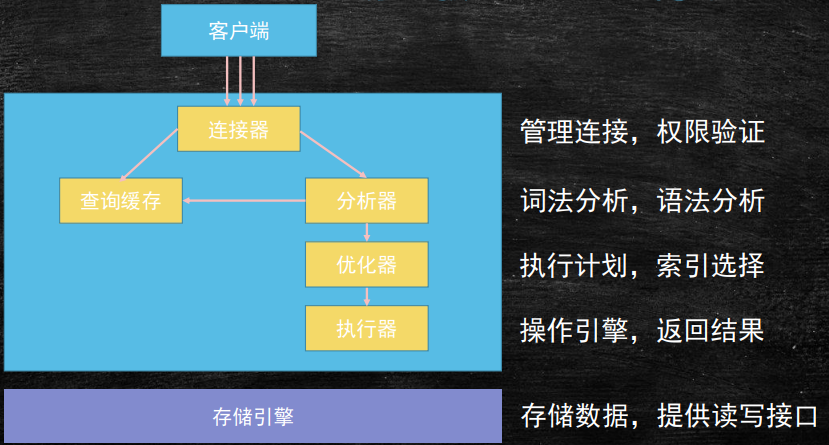
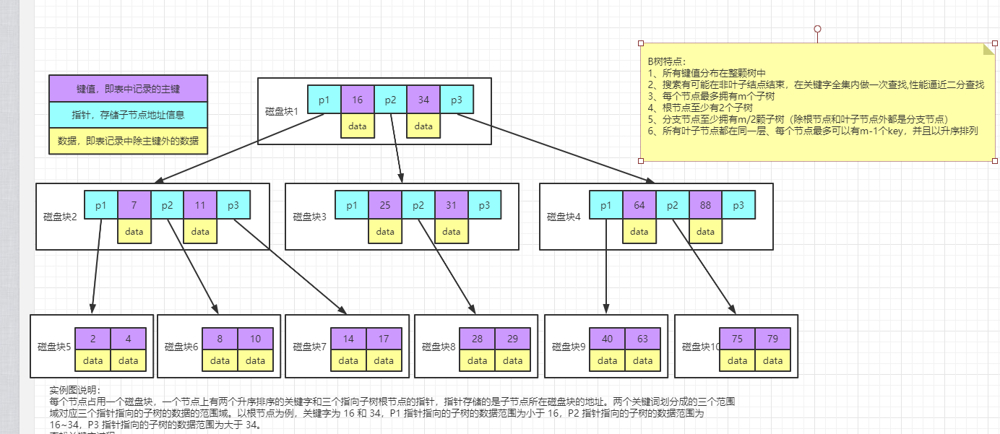
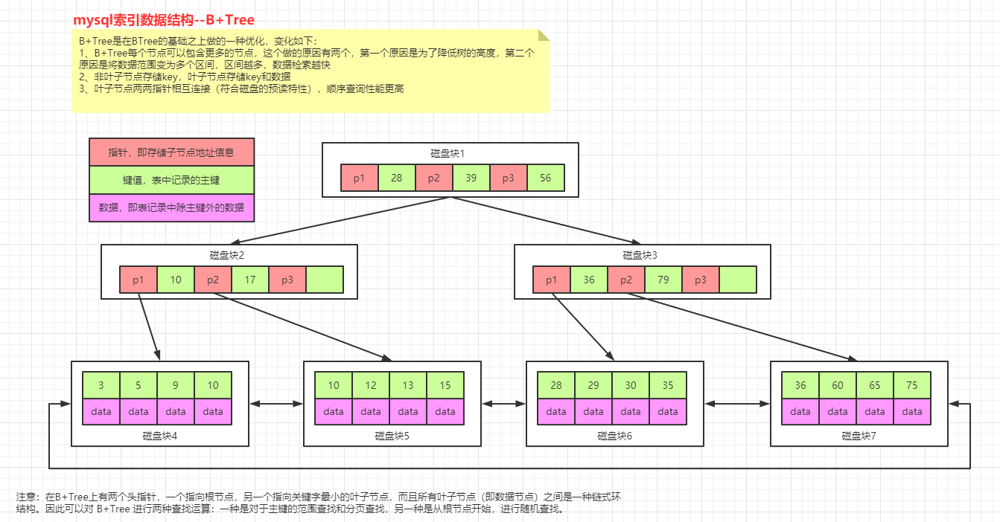

# MySQL

## Mysql基础知识

### 数据存储位置

Linux存储位置: /var/lib/mysqll

windows存放位置:　C:\ProgramData\MySQL\MySQL Server 8.0\Data

### 数据库设计三范式

目的: 减少数据冗余(但可能存在表关联效率低)

1st :  列不可分: 所有字段值都是不可分的原子值(例如省/市/县 应分为三列)  

2nd:  列必须直接依赖主键(不能将多种数据保存在同一张表中, 如学生和教师的信息都保存在同一张表中)

3rd:  传递依赖: 表里面的列不能包含其他表的非主键字段

### mysql架构

> 连接器: show processlist 可查看当前连接数, 连接可分为长连接和短链接, jdbc时短连接, 线程池时长连接, 建议用长连接

> 查询缓存: 不推荐使用,  mysql8版本已没有废弃查询缓存,原因: 1:频繁失效,只要有表更新就失效, 2: 命中率低.    

> 分析器: 语法和词法分析, 生产AST(抽象语法树).  CalCite

> 优化器: 有多个索引时觉得使用哪个索引, 使用Join连接时决定连接顺序, 总之mysql使用它觉得最优的方式来执行, RBO: 基于规则的优化, CBO: 基于成本的优化

> 存储引擎:  不同的存放位置, 不同的文件格式, 主要的存储引擎有innodb (.frm,idb,索引和数据放一起存放) ,  myisam(.frm, .myd, .myi ,索引与数据分开), memory(内存, 无法持久化)

### 数据库事务

备注：InnoDB支持事务, MyISAM不支持事务

定义: 一个最小的不可再分的工作单元；通常一个事务对应一个完整的业务

事务四大特征: ACID

atomicity: 原子性 , undoLog来保证

consistency: 一致性  A I D 共同来实现. 最重要

isolation: 隔离性 , read uncommitted (读未提交, 脏读), read committed (读提交, 不可重复读) , repeatable read(可重读读, 幻读) , serializable串行执行, 默认:repeateble read, 通过锁机制来实现 

durability: 持久性 redoLog来保证

### 索引

计算机基础: 局部性原理(空间/时间) , 磁盘预读

#### 索引实现及优缺点

##### hash 

> 数据全部存入内存, 比较耗费内存空间
>
> 等值查询较快, 范围查询不好处理(企业中范围查询应用更多)\
>
> memory引擎使用了hash作为索引

##### 二叉树, 平衡树, 红黑树

>数深度过深, IO读取次数过多,影响效率

##### B-Tree

> 非叶子节点也存储数据, 每个磁盘块只能存储较少行数据, 树深度过深, IO次数过多. 

##### B+Tree

> 非叶子节点不存储数据, 只存储地址和Key值, 能满足在较小的树深度下存储较多的数据.

> InnoDB叶子节点存储的是 数据和Key的键值对,MyISAM叶子节点存储的是数据地址和Key的键值对

#### 索引分类

##### 主键索引

> 特殊的唯一索引, 不能为null, 每个表只能有一个主键索引, 可有多个唯一索引

##### 唯一索引

>值可以为null

##### 普通索引

> 回表: 查找数据时, 先通过普通索引找到主键索引的值, 然后通过主键索引查找相关数据
>
> 索引覆盖:  查找的数据在索引中(索引字段+主键), 就不需要执行回表操作, 提升效率
>
> 索引下推:  过滤数据时, 以前是将通过索引将数据从存储引擎中检索出来, mysql server来实现过滤, 现在将将过滤数据这一环节放到存储引擎中, 减少从存储引擎 到 mysql server的IO操作.
>
> 谓词下推: ??

##### 全文索引

> 一般不用, 用solar 等代替.

##### 组合索引

> 最左匹配: 组合索引匹配时, 是从左到右开始匹配, 前面列缺失或是范围查找, 后面的列就不能使用索引了.

#### 索引维护

>插入较大值: 直接插入,基本无成本
>
>插入中间值(页未满) : 逻辑上移动后续元素, 空出位置供插入
>
>插入中间值(页已满) : 页分裂
>
>建议:　尽量使用自增索引

### 锁机制

不同存储引擎支持不同的锁机制.MyISAM 和Memory采用表锁, InnoDB采用表锁和行锁. 默认行锁

表级锁: 开销小, 加锁快, 不会出现死锁, 锁定粒度大, 发生锁冲突较高, 并发度最低 

行级锁: 开销大, 加锁慢, 会出现死锁, 锁定粒度小, 发生锁重读教低, 并发度最高 

表锁场景: 查询为主, 少量索引条件更新的应用, 如web应用.??

行锁场景: ??

#### MyISAM锁

表共享读锁:

表独占写锁: 

#### InnoDB锁

InnoDB行锁是基于索引实现的, 若不通过索引访问数据, 就会使用表锁

共享锁:

排他锁:

自增锁:  表锁,用于主键自增

### MySQL执行计划

> 查看方式: explain + SQL statement

#### 执行计划列包含信息

|    Column     |                    Meaning                     |
| :-----------: | :--------------------------------------------: |
|      id       |            The `SELECT` identifier             |
|  select_type  |               The `SELECT` type                |
|     table     |          The table for the output row          |
|  partitions   |            The matching partitions             |
|     type      |                 The join type                  |
| possible_keys |         The possible indexes to choose         |
|      key      |           The index actually chosen            |
|    key_len    |          The length of the chosen key          |
|      ref      |       The columns compared to the index        |
|     rows      |        Estimate of rows to be examined         |
|   filtered    | Percentage of rows filtered by table condition |
|     extra     |             Additional information             |

> ID: 执行顺序, id相同, 从上到下 , Id不同, 数值较大优先级越高

> Select_type: SIMPLE , Primary, UNION, DEPENDENT UNION, UNION RESULT, SUBQUERY, DEPENDENT SUBQUERY, DERIVED, UNCACHEABLE SUBQUERY, UNCACHEABLE UNION
>
> SUBQUERY: 括号里面的子查询,
>
> UNION:UNION 关键字后面的查询
>
> DEPENDENT: IN关键字，里面的都属于dependent
>
> DERIVED:  衍生表

> table: 表名

> type:  system > const > eq_ref > ref > fulltext > ref_or_null > index_merge > unique_subquery > index_subquery > range > index > ALL 

> possible_key: 可能用到的索引

>key_len: 在不损失精度的情况下越短越好.  例如 name作为索引时可只取前面五个字符作为索引

> rows: 预计查询的行

> extra: 额外信息

### 主从复制

> 数据热备

>读写分离

#### 原理

> 1 : master将记录改变日志记录到binlog中
>
> 2: slave 在一定时间间隔内对master二进制文件进行探测, 若发生改变, 开启一个IO thread请求master二进制事件
>
> 3: master为每一个slave节点的IO thread开启log dump线程, 为其发送二进制时间, slave IO thread将二进制事件保存到relaylog中,同时开启一个SQL thread从relaylog中读取日志, 并重放. 最后IO thread 和 SQL thread进入睡眠, 等待下一次被唤醒. 

##### 备注

>1: 连接时需要指导position 号
>
>2: 主从最好版本相同, 若不同, 从库版本应高于主库
>
>3: 主从复制时单线程, binlog日志从master复制到slave中, 由于时顺序读, 效率很高, 这部分不存在延迟, sql thread 重放时 DML和DDL是随机读写, 效率低, 可能产生延迟. 
>
>4: 并行复制技术 -> MTS , 待了解. 

#### 分类

> 一主一从, 一主多从, 主从互备, 多主一丛, 级联

### 读写分离

> mysql-proxy 不推荐
>
> amoeba  阿里开源, 读写分离
>
> mycat 阿里开源, 分库分表, 读写分离

## MySQL调优

#### mysql系统参数设置

##### general 

>datadir=/var/lib/mysql   ->  数据文件存储位置
>
>socket=/var/lib/mysql/mysql.sock -> mysql.socket表示server和client在同一台服务器，并且使用localhost进行连接，就会使用socket进行连接
>
>pid_file=/var/lib/mysql/mysql.pid  ->  mysql的pid
>
>port=3306 ->  端口号
>
>default_storage_engine=InnoDB -> 默认存储引擎
>
>skip-grant-tables  ->  忘记密码时设置该参数跳过密码验证

##### character 

>character_set_client  -> 客户端字符集
>
>character_set_connection -> mysql 会将客户端的消息转换为连接的字符集格式
>
>character_set_results  -> mysql发送消息个客户端的字符集
>
>character_set_database  ->  数据默认字符集
>
>character_set_server       ->  mysql server的默认字符集

##### connection

##### log

##### cache

##### innodb

<<<<<<< HEAD
=======
undolog: 原子性保证

## 性能调优

## 疑问

动态横表转纵表

case column_name when value then value2 end 

举例: 

–1.学生表 
Student(s_id,s_name,s_birth,s_sex) –学生编号,学生姓名, 出生年月,学生性别 
–2.课程表 
Course(c_id,c_name,t_id) – –课程编号, 课程名称, 教师编号 
–3.教师表 
Teacher(t_id,t_name) –教师编号,教师姓名 
–4.成绩表 
Score(s_id,c_id,s_score) –学生编号,课程编号,分数

如何查询 学生及各科成绩, 科目名的列 根据 课程表的中的数据动态来确定

>>>>>>> 978e5bcd22e8227c58b5cef3be5e08c67d8345cc
