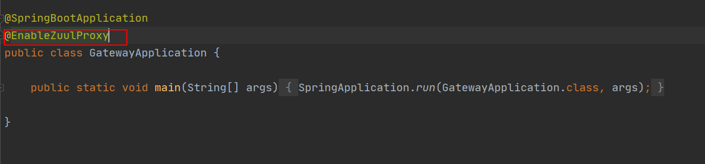

[TOC]

# SpringCloud搭建技术文档

### 1   概况

微服务最基本的五大组件: 服务与注册中心(Eureka Server), 配置中心(Config Center), 网关(Gateway) ,负载均衡(Ribbon) ,断路器(Hystrix)

其他组件: 服务监控(Actuactor),健康检查(Admin),链路追踪(Sleuth和Zipkin)

搭建顺序: 服务注册与发现中心(Eureka) -> Admin->链路追踪(Sleuth和Zipkin)->配置中心(ConfigCenter)->具体服务(服务ABCD) 

### 2   创建空的总项目

        


### 4   创建Admin(新建Model)

需admin Server , admin ui ,(邮件通知需mail)


勾选后需再添加以下starter

```java
		<!--邮件通知-->
		<dependency>
			<groupId>org.springframework.boot</groupId>
			<artifactId>spring-boot-starter-mail</artifactId>
		</dependency>

		<!--Admin UI-->
		<dependency>
			<groupId>de.codecentric</groupId>
			<artifactId>spring-boot-admin-server-ui</artifactId>
		</dependency>
```

POM如下

```
<?xml version="1.0" encoding="UTF-8"?>
<project xmlns="http://maven.apache.org/POM/4.0.0" xmlns:xsi="http://www.w3.org/2001/XMLSchema-instance"
	xsi:schemaLocation="http://maven.apache.org/POM/4.0.0 https://maven.apache.org/xsd/maven-4.0.0.xsd">
	<modelVersion>4.0.0</modelVersion>
	<parent>
		<groupId>org.springframework.boot</groupId>
		<artifactId>spring-boot-starter-parent</artifactId>
		<version>2.3.4.RELEASE</version>
		<relativePath/> <!-- lookup parent from repository -->
	</parent>
	<groupId>com.telefence</groupId>
	<artifactId>admin</artifactId>
	<version>0.0.1-SNAPSHOT</version>
	<name>admin</name>
	<description>Demo project for Spring Boot</description>

	<properties>
		<java.version>15</java.version>
		<spring-boot-admin.version>2.3.0</spring-boot-admin.version>
	</properties>

	<dependencies>
		<!--邮件通知-->
		<dependency>
			<groupId>org.springframework.boot</groupId>
			<artifactId>spring-boot-starter-mail</artifactId>
		</dependency>

		<!--Admin UI-->
		<dependency>
			<groupId>de.codecentric</groupId>
			<artifactId>spring-boot-admin-server-ui</artifactId>
		</dependency>
		<dependency>
			<groupId>de.codecentric</groupId>
			<artifactId>spring-boot-admin-starter-server</artifactId>
		</dependency>

		<dependency>
			<groupId>org.springframework.boot</groupId>
			<artifactId>spring-boot-starter-test</artifactId>
			<scope>test</scope>
			<exclusions>
				<exclusion>
					<groupId>org.junit.vintage</groupId>
					<artifactId>junit-vintage-engine</artifactId>
				</exclusion>
			</exclusions>
		</dependency>
	</dependencies>

	<dependencyManagement>
		<dependencies>
			<dependency>
				<groupId>de.codecentric</groupId>
				<artifactId>spring-boot-admin-dependencies</artifactId>
				<version>${spring-boot-admin.version}</version>
				<type>pom</type>
				<scope>import</scope>
			</dependency>
		</dependencies>
	</dependencyManagement>

	<build>
		<plugins>
			<plugin>
				<groupId>org.springframework.boot</groupId>
				<artifactId>spring-boot-maven-plugin</artifactId>
			</plugin>
		</plugins>
	</build>

</project>
```

主类添加@EnableAdminServer注解


application.xml配置如下


以下为配置微信,邮件或钉钉通知(暂无)

 

 

### 3   创建Eureka Server(新建Model)

需Eureka Server, Actuator, Admin三个starter


主启动类加@EnableEurekaServer注解


POM配置配置如下

```
<?xml version="1.0" encoding="UTF-8"?>
<project xmlns="http://maven.apache.org/POM/4.0.0" xmlns:xsi="http://www.w3.org/2001/XMLSchema-instance"
	xsi:schemaLocation="http://maven.apache.org/POM/4.0.0 https://maven.apache.org/xsd/maven-4.0.0.xsd">
	<modelVersion>4.0.0</modelVersion>
	<parent>
		<groupId>org.springframework.boot</groupId>
		<artifactId>spring-boot-starter-parent</artifactId>
		<version>2.3.4.RELEASE</version>
		<relativePath/> <!-- lookup parent from repository -->
	</parent>
	<groupId>com.telefence</groupId>
	<artifactId>service-discovery</artifactId>
	<version>0.0.1-SNAPSHOT</version>
	<name>service-discovery</name>
	<description>Demo project for Spring Boot</description>

	<properties>
		<java.version>15</java.version>
		<spring-boot-admin.version>2.3.0</spring-boot-admin.version>
		<spring-cloud.version>Hoxton.SR8</spring-cloud.version>
	</properties>

	<dependencies>
		<dependency>
			<groupId>org.springframework.boot</groupId>
			<artifactId>spring-boot-starter-actuator</artifactId>
		</dependency>
		<dependency>
			<groupId>de.codecentric</groupId>
			<artifactId>spring-boot-admin-starter-client</artifactId>
		</dependency>
		<dependency>
			<groupId>org.springframework.cloud</groupId>
			<artifactId>spring-cloud-starter-netflix-eureka-server</artifactId>
		</dependency>

		<dependency>
			<groupId>org.springframework.boot</groupId>
			<artifactId>spring-boot-starter-test</artifactId>
			<scope>test</scope>
			<exclusions>
				<exclusion>
					<groupId>org.junit.vintage</groupId>
					<artifactId>junit-vintage-engine</artifactId>
				</exclusion>
			</exclusions>
		</dependency>
	</dependencies>

	<dependencyManagement>
		<dependencies>
			<dependency>
				<groupId>org.springframework.cloud</groupId>
				<artifactId>spring-cloud-dependencies</artifactId>
				<version>${spring-cloud.version}</version>
				<type>pom</type>
				<scope>import</scope>
			</dependency>
			<dependency>
				<groupId>de.codecentric</groupId>
				<artifactId>spring-boot-admin-dependencies</artifactId>
				<version>${spring-boot-admin.version}</version>
				<type>pom</type>
				<scope>import</scope>
			</dependency>
		</dependencies>
	</dependencyManagement>

	<build>
		<plugins>
			<plugin>
				<groupId>org.springframework.boot</groupId>
				<artifactId>spring-boot-maven-plugin</artifactId>
			</plugin>
		</plugins>
	</build>

</project>
```

 配置文件如下

```xml
server.port=8100

#是否注册为服务和是否拉取服务,只有一个Server时设置为false
eureka.client.register-with-eureka=false
eureka.client.fetch-registry=false

spring.application.name=EurekaServer
eureka.instance.hostname=eureka1.com

#高可用配置,相互注册
#eureka.client.service-url.defaultZone=http://eureka2.com:6380/eureka/,http://eureka3.com:6381/eureka/

#自我保护关闭
#eureka.server.enable-self-preservation=false

#链路追踪
#spring.zipkin.base-url=http://localhost:9411/
#spring.sleuth.sampler.rate=1

#admin监控配置
management.endpoints.web.exposure.include=*
management.endpoint.health.show-details=always
spring.boot.admin.client.url=http://localhost:8000/
```

  启动服务并访问查看是否启动成功 http://127.0.0.1:8100/ 


### 5   创建配置中心 (新建Model)

需Config server, eureka client, admin, actuator


主类添加@EnableConfigServer


POM配置文件如下

```
<?xml version="1.0" encoding="UTF-8"?>
<project xmlns="http://maven.apache.org/POM/4.0.0" xmlns:xsi="http://www.w3.org/2001/XMLSchema-instance"
	xsi:schemaLocation="http://maven.apache.org/POM/4.0.0 https://maven.apache.org/xsd/maven-4.0.0.xsd">
	<modelVersion>4.0.0</modelVersion>
	<parent>
		<groupId>org.springframework.boot</groupId>
		<artifactId>spring-boot-starter-parent</artifactId>
		<version>2.3.4.RELEASE</version>
		<relativePath/> <!-- lookup parent from repository -->
	</parent>
	<groupId>com.telefence</groupId>
	<artifactId>config-center</artifactId>
	<version>0.0.1-SNAPSHOT</version>
	<name>config-center</name>
	<description>Demo project for Spring Boot</description>

	<properties>
		<java.version>15</java.version>
		<spring-boot-admin.version>2.3.0</spring-boot-admin.version>
		<spring-cloud.version>Hoxton.SR8</spring-cloud.version>
	</properties>

	<dependencies>
		<dependency>
			<groupId>org.springframework.boot</groupId>
			<artifactId>spring-boot-starter-actuator</artifactId>
		</dependency>
		<dependency>
			<groupId>de.codecentric</groupId>
			<artifactId>spring-boot-admin-starter-client</artifactId>
		</dependency>
		<dependency>
			<groupId>org.springframework.cloud</groupId>
			<artifactId>spring-cloud-config-server</artifactId>
		</dependency>
		<dependency>
			<groupId>org.springframework.cloud</groupId>
			<artifactId>spring-cloud-starter-netflix-eureka-client</artifactId>
		</dependency>

		<dependency>
			<groupId>org.springframework.boot</groupId>
			<artifactId>spring-boot-starter-test</artifactId>
			<scope>test</scope>
			<exclusions>
				<exclusion>
					<groupId>org.junit.vintage</groupId>
					<artifactId>junit-vintage-engine</artifactId>
				</exclusion>
			</exclusions>
		</dependency>
	</dependencies>

	<dependencyManagement>
		<dependencies>
			<dependency>
				<groupId>org.springframework.cloud</groupId>
				<artifactId>spring-cloud-dependencies</artifactId>
				<version>${spring-cloud.version}</version>
				<type>pom</type>
				<scope>import</scope>
			</dependency>
			<dependency>
				<groupId>de.codecentric</groupId>
				<artifactId>spring-boot-admin-dependencies</artifactId>
				<version>${spring-boot-admin.version}</version>
				<type>pom</type>
				<scope>import</scope>
			</dependency>
		</dependencies>
	</dependencyManagement>

	<build>
		<plugins>
			<plugin>
				<groupId>org.springframework.boot</groupId>
				<artifactId>spring-boot-maven-plugin</artifactId>
			</plugin>
		</plugins>
	</build>

</project>

```

需在配置类中写明以下

```
server.port=8200

#服务名
spring.application.name=ConfigCenter
#拉取服务的地址
eureka.client.service-url.defaultZone=http://eureka1.com:8100/eureka/
#git地址
spring.cloud.config.server.git.uri=https://github.com/Alexander-Zero/SpringCloud-ConfigCenter.git
#分支
spring.cloud.config.label=master

#admin监控配置
management.endpoints.web.exposure.include=*
management.endpoint.health.show-details=always
spring.boot.admin.client.url=http://localhost:8000/
```


### 6   创建网关(新建Model)

需Admin client, Eureka client, zipkin , sleuth, zuul ,actuator


主类添加@EnableZuulProxy



POM文件如下

```
<?xml version="1.0" encoding="UTF-8"?>
<project xmlns="http://maven.apache.org/POM/4.0.0" xmlns:xsi="http://www.w3.org/2001/XMLSchema-instance"
	xsi:schemaLocation="http://maven.apache.org/POM/4.0.0 https://maven.apache.org/xsd/maven-4.0.0.xsd">
	<modelVersion>4.0.0</modelVersion>
	<parent>
		<groupId>org.springframework.boot</groupId>
		<artifactId>spring-boot-starter-parent</artifactId>
		<version>2.3.4.RELEASE</version>
		<relativePath/> <!-- lookup parent from repository -->
	</parent>
	<groupId>com.telefence</groupId>
	<artifactId>gateway</artifactId>
	<version>0.0.1-SNAPSHOT</version>
	<name>gateway</name>
	<description>Demo project for Spring Boot</description>

	<properties>
		<java.version>15</java.version>
		<spring-boot-admin.version>2.3.0</spring-boot-admin.version>
		<spring-cloud.version>Hoxton.SR8</spring-cloud.version>
	</properties>

	<dependencies>
		<dependency>
			<groupId>org.springframework.boot</groupId>
			<artifactId>spring-boot-starter-actuator</artifactId>
		</dependency>
		<dependency>
			<groupId>de.codecentric</groupId>
			<artifactId>spring-boot-admin-starter-client</artifactId>
		</dependency>
		<dependency>
			<groupId>org.springframework.cloud</groupId>
			<artifactId>spring-cloud-starter-netflix-eureka-client</artifactId>
		</dependency>
		<dependency>
			<groupId>org.springframework.cloud</groupId>
			<artifactId>spring-cloud-starter-netflix-zuul</artifactId>
		</dependency>
		<dependency>
			<groupId>org.springframework.cloud</groupId>
			<artifactId>spring-cloud-starter-sleuth</artifactId>
		</dependency>
		<dependency>
			<groupId>org.springframework.cloud</groupId>
			<artifactId>spring-cloud-starter-zipkin</artifactId>
		</dependency>

		<dependency>
			<groupId>org.springframework.boot</groupId>
			<artifactId>spring-boot-starter-test</artifactId>
			<scope>test</scope>
			<exclusions>
				<exclusion>
					<groupId>org.junit.vintage</groupId>
					<artifactId>junit-vintage-engine</artifactId>
				</exclusion>
			</exclusions>
		</dependency>
	</dependencies>

	<dependencyManagement>
		<dependencies>
			<dependency>
				<groupId>org.springframework.cloud</groupId>
				<artifactId>spring-cloud-dependencies</artifactId>
				<version>${spring-cloud.version}</version>
				<type>pom</type>
				<scope>import</scope>
			</dependency>
			<dependency>
				<groupId>de.codecentric</groupId>
				<artifactId>spring-boot-admin-dependencies</artifactId>
				<version>${spring-boot-admin.version}</version>
				<type>pom</type>
				<scope>import</scope>
			</dependency>
		</dependencies>
	</dependencyManagement>

	<build>
		<plugins>
			<plugin>
				<groupId>org.springframework.boot</groupId>
				<artifactId>spring-boot-maven-plugin</artifactId>
			</plugin>
		</plugins>
	</build>

</project>

```


网关配置如下:

```
server.port=8300

spring.application.name=Zuul
eureka.client.service-url.defaultZone=http://eureka1.com:8100/eureka/
#配置服务负载均衡策略
#feignconsumer.ribbon.NFLoadBalancerRuleClassName=com.netflix.loadbalancer.RandomRule

#不走网关的服务
#zuul.ignored-services=provider

#前缀
#zuul.prefix=/api/v1
#zuul.strip-prefix=false

#配置服务的网关
#注意 /和 /** 都要填写
zuul.routes.serviceA=/alex/**

#链路追踪配置
spring.zipkin.base-url=http://localhost:9411/
spring.sleuth.sampler.rate=1

#健康监控
management.endpoints.web.exposure.include=*
management.endpoint.health.show-details=always
spring.boot.admin.client.url=http://localhost:8000/

```


新建Common模块,主要放公共JAR包,公共类和公共API等

POM文件

```

```


### 7   创建链路追踪(新建Model)

下载Zipkin Jar包并启动

下载链接: https://dl.bintray.com/openzipkin/maven/io/zipkin/java/zipkin-server/

需要在网关和具体的服务的POM文件中添加以下以来

```
		<dependency>
			<groupId>org.springframework.cloud</groupId>
			<artifactId>spring-cloud-starter-sleuth</artifactId>
		</dependency>
		<dependency>
			<groupId>org.springframework.cloud</groupId>
			<artifactId>spring-cloud-starter-zipkin</artifactId>
		</dependency>
```

 需要在网关和具体的服务的配置文件中添加以下配置:

```
spring.zipkin.base-url=http://localhost:9411/
spring.sleuth.sampler.rate=1 
```

### 8  新建服务模块

 需Admin client, Eureka client,Config Client, zipkin , sleuth, web,openfeign(包含ribbon 和hystrix) ,actuator等


 

POM文件如下

```
<?xml version="1.0" encoding="UTF-8"?>
<project xmlns="http://maven.apache.org/POM/4.0.0" xmlns:xsi="http://www.w3.org/2001/XMLSchema-instance"
	xsi:schemaLocation="http://maven.apache.org/POM/4.0.0 https://maven.apache.org/xsd/maven-4.0.0.xsd">
	<modelVersion>4.0.0</modelVersion>
	<parent>
		<groupId>org.springframework.boot</groupId>
		<artifactId>spring-boot-starter-parent</artifactId>
		<version>2.3.5.RELEASE</version>
		<relativePath/> <!-- lookup parent from repository -->
	</parent>
	<groupId>com.telefence</groupId>
	<artifactId>demo</artifactId>
	<version>0.0.1-SNAPSHOT</version>
	<name>demo</name>
	<description>Demo project for Spring Boot</description>

	<properties>
		<java.version>15</java.version>
		<spring-boot-admin.version>2.3.0</spring-boot-admin.version>
		<spring-cloud.version>Hoxton.SR8</spring-cloud.version>
	</properties>

	<dependencies>
		<dependency>
			<groupId>org.springframework.boot</groupId>
			<artifactId>spring-boot-starter-actuator</artifactId>
		</dependency>
		<dependency>
			<groupId>org.springframework.boot</groupId>
			<artifactId>spring-boot-starter-web</artifactId>
		</dependency>
		<dependency>
			<groupId>de.codecentric</groupId>
			<artifactId>spring-boot-admin-starter-client</artifactId>
		</dependency>
		<dependency>
			<groupId>org.springframework.cloud</groupId>
			<artifactId>spring-cloud-starter-config</artifactId>
		</dependency>
		<dependency>
			<groupId>org.springframework.cloud</groupId>
			<artifactId>spring-cloud-starter-netflix-eureka-client</artifactId>
		</dependency>
		<dependency>
			<groupId>org.springframework.cloud</groupId>
			<artifactId>spring-cloud-starter-openfeign</artifactId>
		</dependency>
		<dependency>
			<groupId>org.springframework.cloud</groupId>
			<artifactId>spring-cloud-starter-sleuth</artifactId>
		</dependency>
		<dependency>
			<groupId>org.springframework.cloud</groupId>
			<artifactId>spring-cloud-starter-zipkin</artifactId>
		</dependency>

		<dependency>
			<groupId>org.springframework.boot</groupId>
			<artifactId>spring-boot-starter-test</artifactId>
			<scope>test</scope>
			<exclusions>
				<exclusion>
					<groupId>org.junit.vintage</groupId>
					<artifactId>junit-vintage-engine</artifactId>
				</exclusion>
			</exclusions>
		</dependency>
	</dependencies>

	<dependencyManagement>
		<dependencies>
			<dependency>
				<groupId>org.springframework.cloud</groupId>
				<artifactId>spring-cloud-dependencies</artifactId>
				<version>${spring-cloud.version}</version>
				<type>pom</type>
				<scope>import</scope>
			</dependency>
			<dependency>
				<groupId>de.codecentric</groupId>
				<artifactId>spring-boot-admin-dependencies</artifactId>
				<version>${spring-boot-admin.version}</version>
				<type>pom</type>
				<scope>import</scope>
			</dependency>
		</dependencies>
	</dependencyManagement>

	<build>
		<plugins>
			<plugin>
				<groupId>org.springframework.boot</groupId>
				<artifactId>spring-boot-maven-plugin</artifactId>
			</plugin>
		</plugins>
	</build>

</project>

```

主类上添加注解:@EnableEurekaClient , @EnableCircuitBroker, @EnableFeignClients


application.properties文件配置如下

```
server.port=8500

#服务名
spring.application.name=store

#拉取服务的地址
eureka.client.service-url.defaultZone=http://localhost:8100/eureka/

#配置中心拉取服务配置
spring.cloud.config.discovery.enabled=true
spring.cloud.config.discovery.service-id=ConfigCenter
spring.cloud.config.label=master
spring.cloud.config.profile=dev

#配置多个名字可拉取多个配置
#spring.cloud.config.name=store,common

#服务熔断是否开启
feign.hystrix.enabled=true
hystrix.command.default.execution.isolation.strategy=SEMAPHORE
#hystrix.command.default.execution.isolation.strategy 隔离策略，默认是Thread, 可选Thread｜Semaphore
#thread 通过线程数量来限制并发请求数，可以提供额外的保护，但有一定的延迟。一般用于网络调用
#semaphore 通过semaphore count来限制并发请求数，适用于无网络的高并发请求
#hystrix.command.default.execution.isolation.thread.timeoutInMilliseconds 命令执行超时时间，默认1000ms
#hystrix.command.default.execution.timeout.enabled 执行是否启用超时，默认启用true
#hystrix.command.default.execution.isolation.thread.interruptOnTimeout 发生超时是是否中断，默认true
#hystrix.command.default.execution.isolation.semaphore.maxConcurrentRequests 最大并发请求数，默认10，该参数当使用ExecutionIsolationStrategy.SEMAPHORE策略时才有效。如果达到最大并发请求数，请求会被拒绝。理论上选择semaphore size的原则和选择thread size一致，但选用semaphore时每次执行的单元要比较小且执行速度快（ms级别），否则的话应该用thread。
#semaphore应该占整个容器（tomcat）的线程池的一小部分。


#负载均衡策略,若需不同服务配置不同的负载均衡策略,需在ribbon前面加上服务名
ribbon.NFLoadBalancerRuleClassName=com.netflix.loadbalancer.RandomRule
#user.ribbon.NFLoadBalancerRuleClassName=com.netflix.loadbalancer.RandomRule

#同一台实例最大重试次数,不包括首次调用
ribbon.MaxAutoRetries=1
#重试负载均衡其他的实例最大重试次数,不包括首次调用
ribbon.MaxAutoRetriesNextServer=1
#是否所有操作都重试
ribbon.OkToRetryOnAllOperations=false

#链路追踪
spring.zipkin.base-url=http://localhost:9411/
spring.sleuth.sampler.rate=1

#admin监控配置
management.endpoints.web.exposure.include=*
management.endpoint.health.show-details=always
spring.boot.admin.client.url=http://localhost:8000/
```

服务间的相互调用使用@FeignClient, 其中name="user"用来指定服务名,fallback=DemoApiFallback.class用来表示服务无法访问后的情况

```
@FeignClient(name = "user", fallback = DemoApiFalback.class)
public interface DemoApi {

    @GetMapping("/test1")
    String test1();
}

```

fallback类需要加上@Component

```
@Component
public class DemoApiFalback implements DemoApi {
    @Override
    public String test1() {
        return "这是降级后的服务";
    }
}
```

服务熔断的第二种写法, @feignclient中使用fallbackFactory=DemoApiFallbakcFactory.class(需实现FallbackFactory接口)

```
@FeignClient(name = "user", fallbackFactory = DemoApiFallbackFactory.class)
public interface DemoApi {

    @GetMapping("/test1")
    String test1();
}
```

```
@Component
public class DemoApiFallbackFactory implements FallbackFactory<DemoApi> {
    @Override
    public DemoApi create(Throwable cause) {
        return new DemoApi() {
            @Override
            public String test1() {
                return "这是降级后的服务,FallbackFactory模式";
            }
        };
    }
}
```

访问接口返回如下(已成功降级):


备注: 对于需要在服务间相互调用的接口 ,可在common包中抽象出api 

