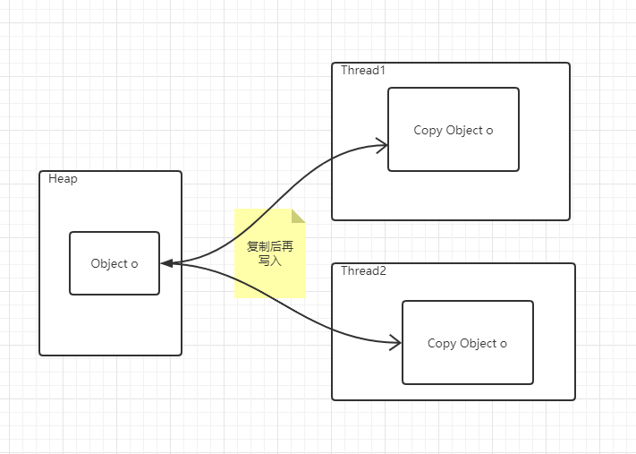
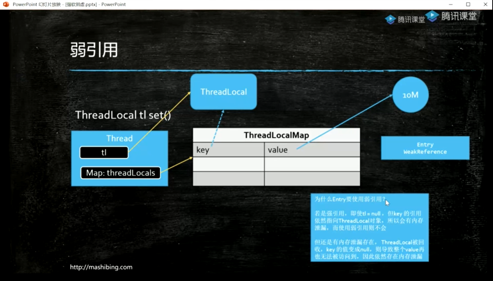

# 单机高并发

## 一 基础概念

### 1.线程相关概念

##### 创建线程的方式(2种/3种)

​	 实现Runnable和继承Thread/或通过线程池来创建 Excecutors.newCachedPool()

```java
//静态方法
Thread.sleep(long time);//静态方法调用, 使线程切换到TimeWaiting状态
Thread.yield();//静态方法调用,使正在调用的线程让出cpu资源(让出后所有线程竞争cpu资源)
//实例方法(使用方法 ??? 调用wait()报错???)
t1.start();//执行线程,使线程切换到Runnable状态(包含Ready和Running状态)
t1.join();//让出CPU资源,让t1线程先执行完.
???????????????????????????????????????????????
t1.wait(long time);//实例方法,会释放锁资源,使线程切换到Waiting状态或者TimeWaiting状态,取决于参数
t1.notify();//使t1线程处于Ready状态???能否唤醒阻塞的线程
t1.notifyAll();//使所有等待处于Ready状态???

```

##### 线程状态,6/7种


JVM内存模型,对象实例创建于heap中, 线程要使用需copy修改值后在copy回去

 

### 2. volatile 关键字

##### 线程可见性

硬件层面: MESI(缓存一致性协议)来保证?? 待补充

##### 禁止指令重排序

double check lock来保证单例 需加 volatile关键字. 因instance = new Instance()可以别分成多个指令(1.分配内存, 2.初始化值, 3. 引用赋值),只要完成 引用赋值 判空时 就不为空, 但指令重排序后可能存在两种结果 1->2->3 或 1->3->2 , 所以存在完成引用赋值后但未被赋初值. 

为什么要指令重排序? 多条指令可能并发执行,为提高执行效率.

在cpu原语上时通过读屏障(loadfence)和写屏障(storefence)来实现????

### 3. Synchronized 

锁对象实现锁定有对象头中的markword来实现的.  synchronized 保证 原子性 , 可见性 和 禁止指令重排

synchronized -> 锁升级(1.5之后):  偏向锁(MarkWord中记录线程ID)->自旋锁(原地等待,占用CPU)->重量级锁=

synchorized锁优化

1.锁细化 , synchorized锁住的代码块越少越好. 

2.锁粗化, 若太多细化的锁,导致争用频繁,不如将锁的范围扩大,只使用一把锁.

3.引用类型的锁对象要防止引用发生变化, 用作锁的对象最好都加上final修饰,防止引用发生改变.

4.锁不应该时String类型, 字符串常量池

5.调用wait() 及抛出异常,将释放锁

##### 自旋锁CAS

 compare and swap(set),乐观锁, 自旋锁, 无锁优化. 位于JUC(java.util.concurrent)包下.

ReentrantLock及 atomicXXX, LongAdder等.实现大致如下,具体见Unsafe类(可直接操纵内存,如分配内存和释放内存方法).`

```java
cas(value,expected,new){
	if(value==expected){
		value==new //备注: CPU原语支持,可保证赋新值时读取到旧值不一致问题
	}
}
```

可能存在ABA问题(对基础类型无影响,对引用类型可能有影响,引用类型引用未改变,但该对象中的其他值已改变).处理方式时加版本号,见AtomicStampedReference类.

自旋锁(Atomic及Lock)及系统锁使用场景(自旋锁占CPU资源)

锁定代码执行时间短,线程数少 -> 自旋锁 , 执行时间长, 线程数多 -> 系统锁  


## 二 JUC同步工具

### 4. ReentrantLock 重入锁

Synchronized 与ReentrantLock区别: ReentrantLock是自旋锁,同时也多了很多功能,如下

```java
ReentrantLock lock = new ReentrantLock();//传true可获的公平锁 new ReentrantLock(true);
lock.lock();
lock.unlock();
//注意,抛异常不释放锁(synchronized异常会释放锁)

//可实现公平锁 公平锁 及后加入的线程 不直接参与争抢锁,需要等前面的争抢后 在加入到等待队列. 
//boolean b = lock.tryLock()是指尝试获取锁,获取与否都要执行后面的逻辑,可通过返回值判断是否需要释放锁
tryLock(),
tryLock(long time,TimeUnit unit); 
//可中断锁(lockInterruptily())的含义时当在尝试获取锁时,调用thread.interupt(),线程可中断不再获取锁(抛出InterruptedException异常), 
//不可中断锁(lock.lock(),synchronized)获取锁时,调用thread.interupt(),线程需在获取锁之后才能中断(抛出InterruptedException异常)
//使用lock.lockInterruptibly()可通过boolean b = lock.isHeldByCurrentThread()来判读是否需要释放锁.
lock.lockInterruptibly();//可中断锁
//lock.newCondition() 是将要等待锁的线程 分成组 可对不同的组内进行加锁解锁等操作
Condition condition = lock.newCondition();
```


### 5.AtomicXXX (原子锁), LongAdder, DoubleAdder(分段锁)

AtomicXXX自旋锁, LongAdder 分段锁(相当于讲有多个AtomicXXX, 分别自旋, 然后将多个Atomic的值相加)

### 6. CountDownLatch  门闩

```java
        CountDownLatch latch = new CountDownLatch(5);
        for (int i = 0; i <20; i++) {
            int finalI = i;
            new Thread(() -> {
                System.out.println("ssss:" + finalI);
                latch.countDown();
            }).start();
        }
        try {
        	//等到latch中的数字减到0,阻塞等待
            latch.await();
            System.out.println("门闩已打开");
        } catch (InterruptedException e) {
            e.printStackTrace();
        }
```

### 7. CyclicBarrier 栅栏

barrier.await()阻塞等待, 等凑齐线程数, 统一开闸让线程开始运行, 构造方法中可传一个线程,也可以不传

```
 		CyclicBarrier barrier = new CyclicBarrier(5, () -> System.out.println("满了,开闸"));
        for (int i = 0; i < 10; i++) {
            int finalI = i;
            new Thread(() -> {
                System.out.println("线程执行:barrier.await()前" + finalI);
                try {
                    barrier.await();
                } catch (InterruptedException e) {
                    e.printStackTrace();
                } catch (BrokenBarrierException e) {
                    e.printStackTrace();
                }
                System.out.println("线程执行:barrier.await()后" + finalI);
            }).start();
        }
```


## 三 引用类型

强引用:不释放,内存无法回收. 

软引用:GC后内存空间不足,回收软引用对象, 常用于缓存

弱引用:GC会回收弱引用对象,常结合强引用,如ThreadLocal.localMap.key, 强引用释放,弱引用

虚引用:GC会回收虚应用对象,并且虚引用对象无法获取,常用于堆外内存管理,如NIO的直接内存管理.

```
Object o = new Object();//强引用
ReferenceQueue<Object> queue = new ReferenceQueue<>();//若有queue,被回收的对象将放在queue中,等待别的线程处理.
SoftReference<Object> softReference = new SoftReference<>(new Object(), queue);//可不传queue
WeakReference<Object> weakReference = new WeakReference<>(new Object(), queue);//可不传queue
PhantomReference<Object> phantomReference = new PhantomReference<>(new Object(), queue);//必传queue
Object object = phantomReference.get();//虚引用无法获取object,即object=null

new Thread(() -> {
    while (true) {
        Reference<?> poll = queue.poll();
        if (poll != null) {
            System.out.println("---对象被回收了---");
        }
    }
}).start();
```



## 四 同步容器

​	

## 五 线程池

Executor -> 只有execute(Runnable run), 将线程定义和执行分开, Executor负责执行, Runnable时具体的线程.

ExecutorService -> extends Executor, 增加了其他方法, 如submit, shutdown等

Executors时线程池的工具类, 类似于Collections, 提供简便创建线程池的方法.

Callable<V> 带有返回值的线程.

Future<V> 将来的结果, 通过阻塞方法future.get()获取结果.

FutureTask<V> = Future (将来结果) + Runnable (任务),

CompletableFuture<V> 各种任务(Runnable)的管理类,如任务组合/链式管理等

ThreadPoolExecutor 用于创建线程池,并执行,

ForkJoinPool  Fork分解,Join汇总,


​	

## 六 JMH


## 七 Disruptor


