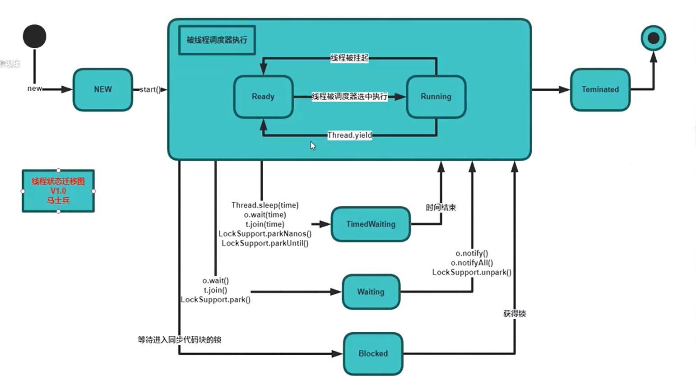

# 单机高并发

1.线程状态,7种



线程切换,join()方法是让别的线程先执行,

锁对象实现锁定有对象头中的markword来实现的. volatile 保证 可见性 和 禁止指令重排, synchronized 保证 原子性 , 可见性 和 禁止指令重排

synchronized -> 锁升级: 偏向锁(MarkWord中记录线程ID)->自旋锁(原地等待,占用CPU)->重量级锁

自旋锁(Atomic及Lock)及系统锁使用场景(自旋锁占CPU资源)

锁定代码执行时间短,线程数少 -> 自旋锁 , 执行时间长, 线程数多 -> 系统锁  

java内存模型: 对象分配在heap中, 若线程要使用,从heap中复制一份到线程中,修改后在复制回去, 所以在高并发中存在同步问题

volatile可见性保证:MESI(缓存一致性协议)

禁止指令重排序(Double Check Lock 单例中是否加volatile?) , 在cpu原语上时通过读屏障(loadfence)和写屏障(storefence)来实现.

new 对象分为多个指令,含(1.分配内存, 2.初始化, 3.赋值给对象),这三条指令可能被重排序, 若不加volatile可能在判空时获取的时初始化一般的对象,即含初值(不是初始化后的初值)的对象. 导致业务逻辑有误, 所以需要添加volatile. 

为什么要指令重排序? 多条指令可能并发执行,为提高执行效率.

synchorized锁优化

1.锁细化 , synchorized锁住的代码块越少越好. 

2.锁粗化, 若太多细化的锁,导致争用频繁,不如将锁的范围扩大,只使用一把锁.

3.引用类型的锁对象要防止引用发生变化, 用作锁的对象最好都加上final修饰,防止引用发生改变.

CAS: compare and swap(set),乐观锁, 自旋锁, 无锁优化. 位于JUC(java.util.concurrent)包下.

常见的atomic开头的,如atomicInteger,AtomicLong等.实现大致如下,具体见Unsafe类(可直接操纵内存,如分配内存和释放内存方法).`

```java
cas(value,expected,new){
	if(value==expected){
		value==new //备注: CPU原语支持,可保证赋新值时读取到旧值不一致问题
	}
}
```

可能存在ABA问题(对基础类型无影响,对引用类型可能有影响,引用类型引用未改变,但该对象中的其他值已改变).处理方式时加版本号,见AtomicStampedReference类.

