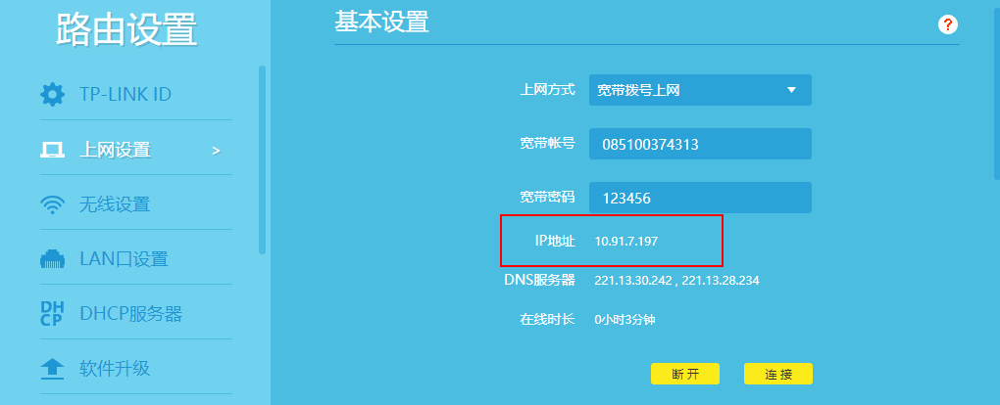
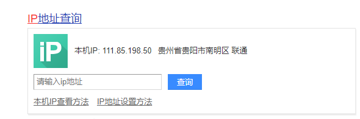

# 服务器框架搭建

window 安装 WSL 2
https://docs.microsoft.com/en-us/windows/wsl/install-win10

https://zhuanlan.zhihu.com/p/188505502

https://blog.csdn.net/weixin_42349272/article/details/113321945

https://github.com/arkane-systems/genie


### Mysql搭建

下载地址: https://dev.mysql.com/downloads/mysql/

修改远程连接:

USE mysql;

修改host字段为'%':  update user set host = '%' where user = 'root';

刷新权限: FLUSH PRIVILEGES;


centos 8 安装

教程: https://www.cnblogs.com/yunian139/p/11804965.html

step 1: wget  https://dev.mysql.com/get/Downloads/MySQL-8.0/mysql-8.0.23-linux-glibc2.12-x86_64.tar.xz

step 2: tar -Jxvf mysql-8.0.23-linux-glibc2.12-x86_64.tar.xz 

step 3: mv mysql-8.0.23-linux-glibc2.12-x86_64 mysql

step 4: mkdir data  [under mysql directory ]

step 5: 

centos7 安装Mysql 5.7

https://www.techgrow.cn/posts/988f02de.html


centos8 安装mysql8

> **安装Yum Repository**:

> wget https://repo.mysql.com//mysql80-community-release-el8-1.noarch.rpm

> **使用rpm来安装MySQL**
> [root@localhost ~]# rpm -ivh mysql80-community-release-el8-1.noarch.rpm

> **使用yum安装mysql服务**

> [root@localhost ~]# yum install mysql-server


Linux 

### Centos7

安装下载 centos7 everything version

ultraISO 软通碟 制作U盘启动 - 

步骤: 打开文件 -->  启动  -->  写入硬盘   

装系统 -> 设置网络等


### JDK1.8

下载: https://download.oracle.com/otn/java/jdk/8u271-b09/61ae65e088624f5aaa0b1d2d801acb16/jdk-8u271-linux-x64.tar.gz?AuthParam=1609068402_ec6cf32314b781accb6276561fba0585

复制到 linux 并解压:

```
tar -zxvf  jdk1.8.tar.gz
```

修改 jdk1.8.xxx 为 jdk

```
mv jdk1.8xxx  jdk 
```

修改环境变量 

```
vim /etc/profile
```

再末尾添加环境变量

```
export JAVA_HOME=/usr/local/jdk
export PATH=$JAVA_HOME/bin:$PATH
export CLASSPATH=.:$JAVA_HOME/lib/dt.jar:$JAVA_HOME/lib/tools.jar
```

刷新环境变量

```
source /etc/profile
```

查看是否安装好

```
java -version
```


配置域名

tplink 虚拟服务器 设置  或  DMZ主机 设置, 一般这样就可以访问了

但现在不能通过外网访问: 

https://service.tp-link.com.cn/detail_article_2577.html

原因是: 非公网ip



公网IP




gitlab


nigix


nexus  maven库 


SSL


