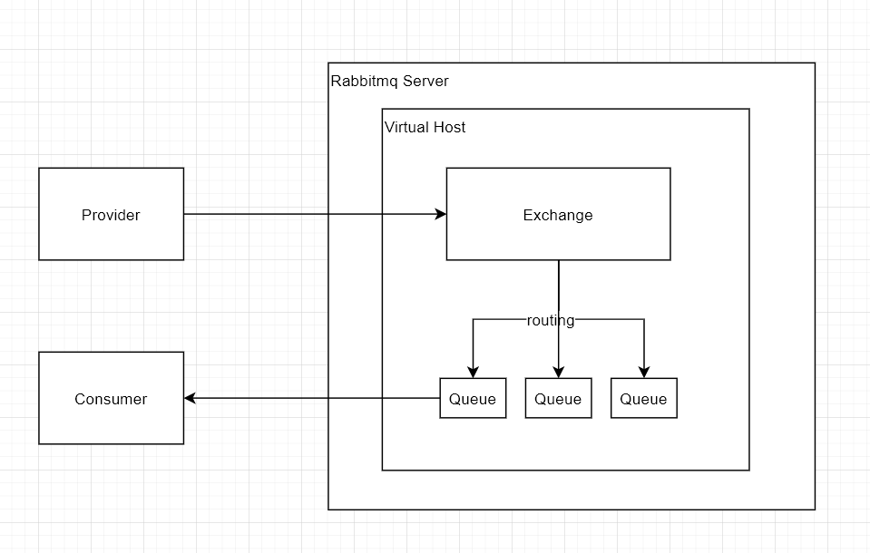

# 消息中间件

### 1.RabbitMQ

服务器安装:

https://www.rabbitmq.com/install-rpm.html

```shell
curl -s https://packagecloud.io/install/repositories/rabbitmq/erlang/script.rpm.sh | sudo bash

curl -s https://packagecloud.io/install/repositories/rabbitmq/rabbitmq-server/script.rpm.sh | sudo bash

yum install erlang
yum install rabbitmq-server

启动rabbitMQ: systemctl start rabbitmq-server.service
查看rabbitMQ状态: rabbitmqctl status

firewall-cmd --zone=public --list-ports            # 查询端口开放列表
firewall-cmd --zone=public --query-port=9200/tcp   #查询具体端口是否开放
```

rabbitmq模型



RabbitMQ常见模型有hello world, work queue, fanout, routing, topic , rpc , publish confirm等

https://www.rabbitmq.com/getstarted.html

hello world:

​	provider 直接将消息发布到Queue上, Consumer消费直接通过routing获取. 


work queue:

​	同hello world, provider直接将消息发布到Queue上, 但Consumer 有多个, 也是通过routing获取消息.


fanout:

​	 发布订阅模式, 可存在多个订阅者, Provider将消息发布到Exchange上, 为每一Consumer建一个动态建一个队列供消费者消费.


routing:

​	路由模式, Provider将消息发布到交换机上, 不同的消息走不同的路由, Consumer通过交换机和路由获取消息. 消息队列名可指定也可不指定


topic: 

​	动态路由模式, 发布同Provider, 但一般路由的命名方式为a.b.c的格式, Consumer通过交换机和路由获取消息,但路由的书写方式类似于正则,如user.*, user.#, * 表示匹配一个或零个单词, #表示匹配零个或多个单词.


RPC:

​	类似于远程调用


publish Confirms: 

​	生产者可通过额外方式来确认rabbitmq-server是否收到消息.


2.Kafka

3.RocketMQ


防火墙相关操作

1、开启防火墙 
    systemctl start firewalld

2、开放指定端口
      firewall-cmd --zone=public --add-port=1935/tcp --permanent
 命令含义：
--zone #作用域
--add-port=1935/tcp  #添加端口，格式为：端口/通讯协议
--permanent  #永久生效，没有此参数重启后失效

3、重启防火墙 
	firewall-cmd --reload

4、查看端口号
netstat -ntlp   //查看当前所有tcp端口·

netstat -ntulp |grep 1935   //查看所有1935端口使用情况·


