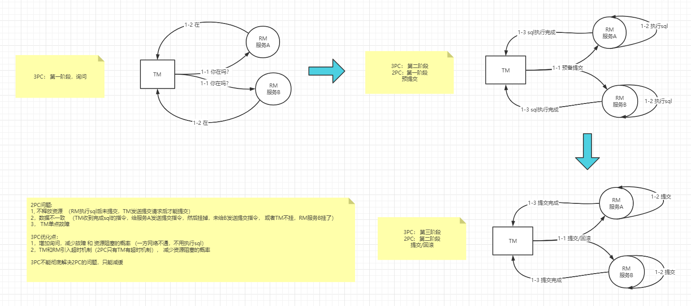

## project

注意: trade off, 任何技术都有优缺点,


### 项目介绍

技术架构图

整体架构图

时序图


### eureka

注意: 外部框架引用三部曲  1: POM 2.config 3.@EnableXXX

注意: 源码查看方式, 可看日志文件 ????


优化: 

> ```yml
> #EurekaServer
> #自我保护:
> eureka.server.enable-self-preservation=true //注册服务少时关闭自我保护 或 降低阈
> eureka.server.renewal.percent.threshold=0.85 //注册服务多时开启自我保护 并 提高阈值
> #缓存同步
> eureka.server.use-read-only-response-cache=false //不启用ReadOnlyMap
> eureka.server.response-cache-update-interval-ms=30 //ReadOnly同步时间间隔 
> #剔除任务
> eureka.server.eviction-interval-timer-in-ms= 1000 //将间隔时间设小一点,快速下线
> 
> #EurekaClient
> #拉取间隔时间
> eureka.client.registry-fetch-interval-seconds=30
> #续约间隔时间
> eureka.instance.lease-renewal-interval-in-seconds=30
> #打乱地址,不超过3个
> eureka.client.service-url.defaultZone=url1,url2,url3
> ```
>
>  1,目的: 减少服务上下线延时
>
>  2,先停服后下线, 避免自动续约
>
> 
>
>  源码: 
>
> Timer -> evitTask() 时间间隔 
>
> ```
> 使用ScheduledExecutorService代替Timer吧
> 多线程并行处理定时任务时，Timer运行多个TimeTask时，只要其中之一没有捕获抛出的异常，其它任务便会自动终止运行，使用ScheduledExecutorService则没有这个问题
> ```
>
> evit(){
>
> ​	可剔除数 =  注册数 - 注册数 * 心跳阈值
>
> }


#### eureka server

启动后 拉取其他节点的, 并开启剔除定时任务

注册: register (ApplicationResource)

续约: renew 

集群同步:  replicateToPeers  , 每次注册和续约都要调用该方法

拉取:  增量拉取(all_apps_delta), 全量拉取(apps_all)

下线: cancel , 调用internalCancel

剔除 : evit 定时任务，调用internalCancel


区域设置: 优先拉取同区域的服务

```
eureka: 
	client:
    	region: bj
        availability-zones:
          bj: z1,z2
        service-url:
          z1: http://localhost:7911/eureka/,http://localhost:7912/eureka/
          z2: http://localhost:7921/eureka/,http://localhost:7922/eureka/
        prefer-same-zone-eureka: true
```

CAP => AP  保证AP, 

1.三级缓存。

2.从其他peer拉取注册表。peer。int registryCount = this.registry.syncUp()，没有满足C的地方。

3.P：网络不好的情况下，还是可以拉取到注册表进行调用的。服务还可以调用。


#### eureka client

client 是与server交互的配置, instance是自身的配置

注册

续约

拉取

下线

#### 服务测算

client 需要拉取 和 续约

每天服务数 = (每分钟续约数 + 每分钟拉取数 ) * 60 * 24 * 服务数

每天几十W没问题. 


### 灰度发布

#### 蓝绿发布

版本１，版本２共存，版本２稳定后删除版本１，不稳定回滚版本１.　（版本１与２服务器数量相同）

优点：不停服，

缺点：资源浪费，需要多一倍的服务器，一段时间内新老服务共存


#### 滚动发布

蓝绿发布的改进，例３台版本１，１台版本２，　１台　版本１＝＞版本２，　直至全部为版本２

优点：不停服，较蓝绿节省部分服务器

缺点：一段时间内新老服务共存

#### 灰度发布

蓝绿发布和滚动发布在一定时间内新老服务完全共存，若有bug, 会影响现有业务

灰度发布 可 动态制定路由规则, 可实现精确 将部分用户 路由到 旧版本. 逐渐扩大 用户范围, 带新版本无误后全部更新至新版本

A/B Test

***注意的点： 无论 网关 => 服务  还是  服务A => 服务B， 开启灰度规则时对所有服务， 需要一张表来配置是否 调用的服务是否 开启 灰度发布***

##### 网关   =>  服务

**重要** 若Instance元数据中没有相应值会报错， 可通过instance.meatamap={"a":"b"}来配置默认元数据

pom

```
<dependency>
    <groupId>io.jmnarloch</groupId>
    <artifactId>ribbon-discovery-filter-spring-cloud-starter</artifactId>
    #无法启动，加入exclude
    <exclusions>
				<exclusion>
					<artifactId>xstream</artifactId>
					<groupId>com.thoughtworks.xstream</groupId>
				</exclusion>
	</exclusions>
</dependency>
<dependency>
    <groupId>org.springframework.cloud</groupId>
    <artifactId>spring-cloud-starter-netflix-zuul</artifactId>
</dependency>

```

Filter

```
@Component
public class GrayFilter extends ZuulFilter {
    @Override
    public String filterType() {
        return FilterConstants.PRE_TYPE;
    }

    @Override
    public int filterOrder() {
        return 0;
    }

    @Override
    public boolean shouldFilter() {
        return true;
    }

    @Override
    public Object run() throws ZuulException {
        RequestContext currentContext = RequestContext.getCurrentContext();
        HttpServletRequest request = currentContext.getRequest();
        String userId = request.getHeader("userId");
		//查库:  用户信息 + 路由规则表 => 具体服务
		RibbonFilterContextHolder.clearCurrentContext();
        if ("1".equals(userId)) {
            RibbonFilterContextHolder.getCurrentContext().add("myName", "zero");
        } else {
            RibbonFilterContextHolder.getCurrentContext().add("myName", "alex");
        }
        return null;
    }
}
```

动态更新 service metadata

>1, 查看信息  http://localhost:7900/eureka/apps/api-auth  或   http://localhost:7900/eureka/apps
>
>2,  更新元数据  PUT /eureka/apps/**appID**/**instanceID**/metadata?key=value


##### 服务A => 服务B

方法1： 重写IRule 实现

```java
//获取当前请求参数的类
@Component
public class RequestUtils {
    public static String getUserId() {
        HttpServletRequest request = ((ServletRequestAttributes) RequestContextHolder.getRequestAttributes()).getRequest();
        return request.getHeader("userId");
    }
}

//需注入到容器
public class GrayRule extends AbstractLoadBalancerRule {

    @Override
    public void initWithNiwsConfig(IClientConfig clientConfig) {
    }

    @Override
    public Server choose(Object key) {
        return choose(getLoadBalancer(), key);
    }

    private Server choose(ILoadBalancer loadBalancer, Object key) {
        List<Server> servers = loadBalancer.getAllServers();
        String userId = RequestUtils.getUserId();
        String myName = null;
        //需判断调用的微服务是否开启灰度发布
        //查库 user id =>  version/metadata
        if ("1".equals(userId)) {
            myName = "alex";
        } else if ("2".equals(userId)) {
            myName = "zero";
        }


        if (myName != null) {
            for (Server server : servers) {
                if (server.isReadyToServe() && server.isAlive()) {
                    Map<String, String> metadata = ((DiscoveryEnabledServer) server).getInstanceInfo().getMetadata();
                    String metaMyName = metadata.get("myName");
                    if (myName.equals(metaMyName)) {
                        return server;
                    }
                }
            }
        }
        return servers.get(new Random().nextInt(servers.size()));
    }
}
```


方法2

通过在RibbonFilterContextHolder中添加属性

POM

```pom
<dependency>
    <groupId>io.jmnarloch</groupId>
    <artifactId>ribbon-discovery-filter-spring-cloud-starter</artifactId>
    <version>2.1.0</version>
</dependency>
```

A :  Filter实现

```
@Component
public class GrayFilter  implements Filter {

    @Override
    public void doFilter(ServletRequest servletRequest, ServletResponse servletResponse, FilterChain filterChain) throws IOException, ServletException {
        HttpServletRequest request = (HttpServletRequest) servletRequest;
        String userId = request.getHeader("userId");

        String myName = null;
        //需判断调用的微服务是否开启灰度发布
        //查库 user id =>  version/metadata
        if ("1".equals(userId)) {
            myName = "alex";
        } else if ("2".equals(userId)) {
            myName = "zero";
        }

        if(myName != null){
            RibbonFilterContextHolder.clearCurrentContext();
            RibbonFilterContextHolder.getCurrentContext().add("myName",myName);
        }
        filterChain.doFilter(servletRequest,servletResponse);
    }
    
}
```

B：切面实现

```java
@Aspect
@Component
public class RibbonAspect {

    @Pointcut("execution(* com.zero.apistaff.controller.*Controller*.*(..))")
    public void ribbonPointCut() {
    }

    @Before("ribbonPointCut()")
    public void addFilter(JoinPoint joinPoint) {
        HttpServletRequest request = ((ServletRequestAttributes) RequestContextHolder.getRequestAttributes()).getRequest();
        String userId = request.getHeader("userId");
        System.out.println("xxxx");
        String myName = null;
        //需判断调用的微服务是否开启灰度发布
        //查库 user id =>  version/metadata
        if ("1".equals(userId)) {
            myName = "alex";
        } else if ("2".equals(userId)) {
            myName = "zero";
        }

        if (myName != null) {
            RibbonFilterContextHolder.clearCurrentContext();
            RibbonFilterContextHolder.getCurrentContext().add("myName", myName);
        }
    }
}
```


### 网关

#### 配置

```yaml
#注意： 写地址 以/ 开头， **结尾
zuul.prefix=api
zuul.strip-prefix=true 
#忽略，header透传   
zuul.ignored-headers=token
zuul.ignored-services=api-auth
zuul.ignored-patterns=/*-driver/**
#服务名，简写
zuul.routes.api-auth=/api-auth/**
#主机转发 SimpleHostFilter
zuul.routes.custom-route.path=/api-auth/**
zuul.routes.custom-route.url=http://loclhost:8004/
#服务名转发RibbonRoutingFilter
zuul.routes.custom-route2.path=/api-auth/**
zuul.routes.custom-route2.service-id=api-auth
```


#### 网关用途

>1, 分发服务
>
>2，身份认证
>
>3，过滤请求，黑白名单
>
>4，监控
>
>5，路由
>
>7，限流

#### 限流

令牌桶算法： 以一定速率生成令牌， 将其放入固定容量的桶中，允许溢出，取到令牌的允许执行

实现： google guava

```java
//网关限流, RateLimiter需设置为常量
//后面的过滤器中需要从上下文中取出 CONTINUE_RUN 的值判断是否继续执行  shouldFilter()
@Component
public class RateLimitFilter extends ZuulFilter {
    public static final RateLimiter RATE_LIMITER = RateLimiter.create(1);

    public static final String CONTINUE_RUN = "continue-run";

    @Override
    public String filterType() {
        return FilterConstants.PRE_TYPE;
    }

    @Override
    public int filterOrder() {
        return Integer.MIN_VALUE;
    }

    @Override
    public boolean shouldFilter() {
        return true;
    }

    @Override
    public Object run() throws ZuulException {

        boolean get = RATE_LIMITER.tryAcquire();
        if (!get) {
            RequestContext.getCurrentContext().setSendZuulResponse(false);
            RequestContext.getCurrentContext().setResponseStatusCode(HttpStatus.TOO_MANY_REQUESTS.value());
        }
        RequestContext.getCurrentContext().set(CONTINUE_RUN, get);
        return null;
    }
}
```


#### 生产中的实际问题

1，token不往后传

> 设置sensative header, 源码见PreDecorationFilter

2,   老项目改造，urlA => urlB 映射问题

>过滤器实现， 从 db或配置文件中读取 映射表，做转发 或 修改context内容

3，动态路由问题  不同用户 => 不同服务

>过滤器实现 
>
>currentContext.setRouteHost(new URI("http://localhost:8003/test/sms-test3").toURL());


### 分布式事务

#### 事务

##### ACID 

>Atomic: 原子性
>
>Consistancy: 一致性
>
>Isolation: 隔离性
>
>Duration: 持久性

redo.log , undo.log保证 原子性和持久化 

锁 保证 一致性和隔离性

##### 隔离级别

>读未提交               =》    脏读，不可重复读
>
>读已提交               =》   不可重复读 
>
>可重复读               =》   幻读 （没查到数据，但会存在冲突的情况）
>
>序列化                   =》   


#### 2PC/3PC

##### 2PC问题

>1, 不释放资源 （RM执行sql后未提交，TM发送提交请求后才能提交）
>
>2，数据不一致  （TM收到完成sql的指令，给服务A发送提交指令，然后挂掉，未给B发送提交指令， 或者TM不挂，RM服务B挂了）
>
>3， TM单点故障


##### 3PC优化点

>1，增加询问，减少故障 和 资源阻塞的概率 （一方网络不通，不用执行sql）
>
>2，TM和RM引入超时机制（2PC只有TM有超时机制）， 减少资源阻塞的概率
>
>3,   3PC不能彻底解决2PC的问题，只能减缓




#### lcn (lock  confirm notify)


#### tcc (try confirm cancel)


#### seata


#### 消息队列+事务+事务表


#### 消息队列+可靠消息


#### 事务消息

#### 最大努力通知


### 分布式锁

#### mysql主键冲突

#### redis

#### redisson

#### 红锁

#### etcd

#### zookeeper


### 注解

```java
@PropertySource("classpath:/eureka/server.properties")  //把配置文件加载到Enviroment, 与@Configuration一起使用
@ConfigurationProperties("eureka.dashboard")  //绑定属性到类上,单独使用不会注册到IOC, 需配合@Component 或 @EnableConfigurationProperties
@EnableConfigurationProperties({ EurekaDashboardProperties.class}) //将@ConfigurationProperties的属性注册到IOC

@ConditionalOnBean(EurekaServerMarkerConfiguration.Marker.class)  //Ioc有Marker实例, 配置文件生效
@ConditionalOnMissingBean
@ConditionalOnProperty(prefix = "eureka.dashboard", name = "enabled", matchIfMissing = true)

    
@AutoConfigureBefore 
@AutoConfigureAfter

```

spring.factories

```properties
org.springframework.boot.autoconfigure.EnableAutoConfiguration=xxx
org.springframework.cloud.bootstrap.BootstrapConfiguration=xxx
org.springframework.boot.Bootstrapper=xx
```